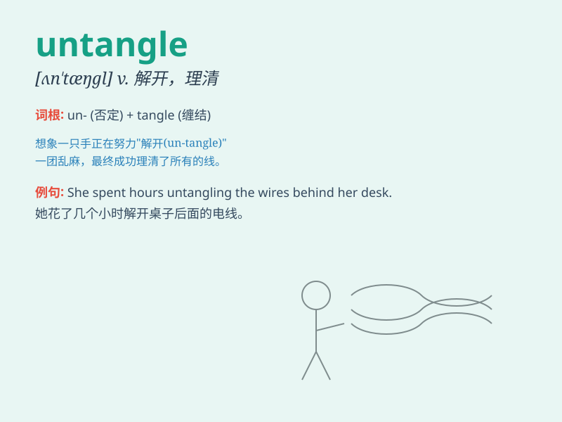

## untangle

**英音:** _[ʌn\'tæŋg(ə)l]_ **美音:** _[,ʌn\'tæŋɡl]_

**译义:** *v.解开*

### 短语

+ **untangle a knot:** _解开一个结_

+ **untangle the problem:** _解决这个问题_

+ **untangle the wires:** _解开电线_

+ **untangle the relationship:** _理清关系_

+ **untangle the confusion:** _消除困惑_

### 例句

#### 例句1

> **She spent hours trying to untangle the knots in her hair.**

**中文翻译:** 她花了几个小时试图解开头发上的结。

**单词释义:** 解开；理清

#### 例句2

> **It took him a long time to untangle the complex problem.**

**中文翻译:** 他花了很长时间来理清这个复杂的问题。

**单词释义:** 解决；梳理清楚

#### 例句3

> **The detective managed to untangle the web of lies and find the
truth.**

**中文翻译:** 侦探设法理清了谎言的网并找到了真相。

**单词释义:** 揭开；理清

### 背诵小故事

> A little monkey got its tail tangled in a vine. It struggled hard but
couldn\'t get free. Finally, with the help of its friends, it managed to
untangle its tail and happily continued playing.

**一只小猴子的尾巴被藤蔓缠住了。它拼命挣扎却无法挣脱。最后，在朋友们的帮助下，它成功解开了尾巴的缠绕，开心地继续玩耍。**

### 图义

