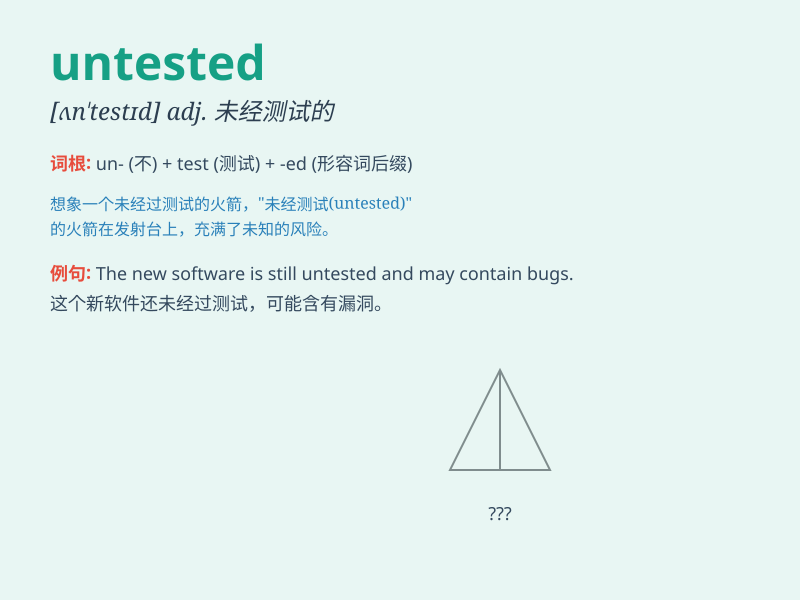

## untested

**英音:** _[ʌnˈtestɪd]_ **美音:** _[ʌnˈtɛstɪd]_

**译义:** *adj.未经测试的，未经验证的；未经考验的*

### 短语

+ **untested theory:** _未经检验的理论_

+ **untested method:** _未经验证的方法_

+ **untested assumption:** _未经证实的假设_

+ **untested product:** _未测试的产品_

+ **untested technology:** _未测试的技术_

### 例句

#### 例句1

> **The untested theory remains controversial among scientists.**

**中文翻译:** 这个未经检验的理论在科学家中仍然存在争议。

**单词释义:** 未经检验的

#### 例句2

> **We are cautious about using the untested drug on patients.**

**中文翻译:** 我们对在病人身上使用这种未经测试的药物持谨慎态度。

**单词释义:** 未经测试的

#### 例句3

> **The untested method might lead to unexpected results.**

**中文翻译:** 这种未经试验的方法可能会导致意想不到的结果。

**单词释义:** 未经试验的

### 背诵小故事

> A young scientist had an untested theory. He was nervous but decided
to present it. Everyone was skeptical at first. But after tests, it
turned out to be revolutionary. The word \'untested\' means not having
been tested.

**一位年轻的科学家有一个未经测试的理论。他很紧张但还是决定展示出来。起初大家都持怀疑态度。但经过测试，它竟然是革命性的。单词\'untested\'意思是未经测试的。**

### 图义

