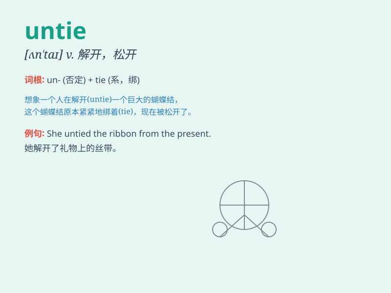

## untie

**英音:** _[ʌn\'taɪ]_ **美音:** _[ʌn\'taɪ]_

**译义:** *vt.解开,解放,解决vi.松开,解开*

### 短语

+ **untie a knot:** _解开一个结_

+ **untie the rope:** _解开绳子_

+ **untie one\'s shoelaces:** _解开某人的鞋带_

+ **untie a package:** _解开包裹_

+ **untie a bundle:** _解开一捆东西_

### 例句

#### 例句1

> **He untied the rope and set the boat free.**

**中文翻译:** 他解开了绳子，让船自由了。

**单词释义:** 解开

#### 例句2

> **She untied her shoelaces before entering the house.**

**中文翻译:** 她在进屋前解开了鞋带。

**单词释义:** 解开

#### 例句3

> **The prisoner managed to untie his hands and escape.**

**中文翻译:** 那个囚犯设法解开了双手并逃跑了。

**单词释义:** 解开

### 背诵小故事

> One day, a little boy was trapped in a room with a tied rope. He
struggled to untie the rope and finally succeeded. With the rope untied,
he happily ran out of the room.

**有一天，一个小男孩被困在一个房间里，有一根系着的绳子。他努力解开绳子，最终成功了。绳子解开后，他高兴地跑出了房间。**

### 图义

