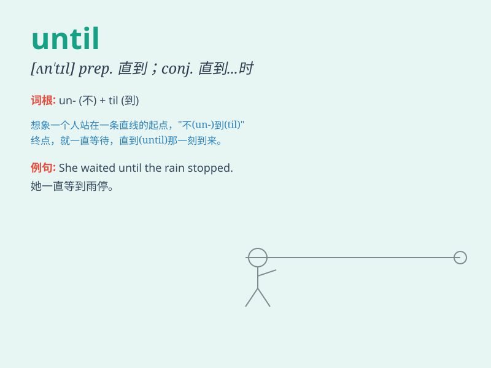

## until

**英音:** _[ən\'tɪl]_ **美音:** _[ən\'tɪl]_

**译义:** * prep.到\...为止,在\...以前
conj.到\...为止,在\...以前,直到\...才*

### 短语

+ **until now:** _直到现在_

+ **until then:** _直到那时_

+ **until later:** _直到稍后_

+ **until recently:** _直到最近_

+ **until tomorrow:** _直到明天_

### 例句

#### 例句1

> **I will wait until you come back.**

**中文翻译:** 我会一直等到你回来。

**单词释义:** 直到\...\...为止

#### 例句2

> **He didn\'t leave until midnight.**

**中文翻译:** 他直到午夜才离开。

**单词释义:** 直到\...\...才

#### 例句3

> **Let\'s not make a decision until we have more information.**

**中文翻译:** 在我们获得更多信息之前，咱们先别做决定。

**单词释义:** 直到\...\...

### 背诵小故事

> A little mouse was lost in a big maze. It kept running until it found
the exit. It didn\'t stop before that. \'Until\' means up to a certain
point in time.

**一只小老鼠在一个大迷宫里迷路了。它一直跑，直到找到了出口。在此之前它都没有停下。'until'意思是直到某个时间点。**

### 图义

