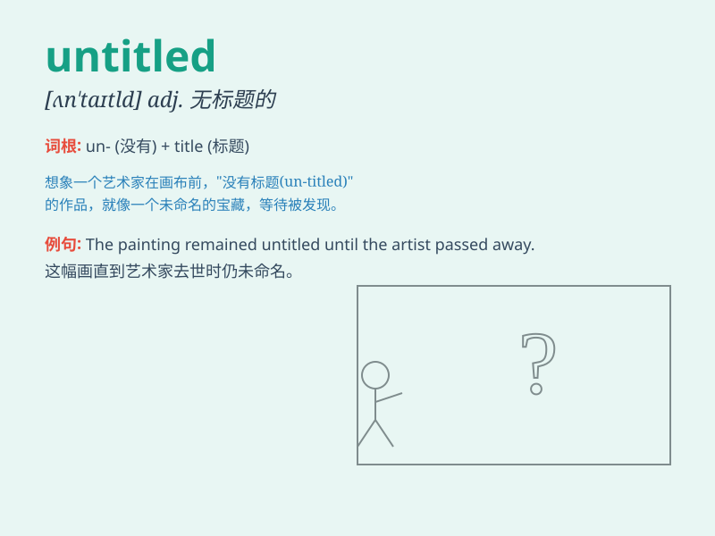

## untitled

**英音:** _[ʌn\'taɪt(ə)ld]_ **美音:** _[,ʌn\'taɪtld]_

**译义:** *adj.无标题的,无称号的,无权利的*

### 短语

+ **untitled album:** _未命名的专辑_

+ **untitled book:** _未命名的书_

+ **untitled film:** _未命名的电影_

+ **untitled poem:** _未命名的诗_

+ **untitled project:** _未命名的项目_

### 例句

#### 例句1

> **The book is untitled, making it difficult to identify at first
glance.**

**中文翻译:** 这本书没有标题，一开始很难辨认。

**单词释义:** 未命名的；无标题的

#### 例句2

> **The painting, still untitled, is expected to fetch a high price
at the auction.**

**中文翻译:** 这幅仍未命名的画预计在拍卖会上拍出高价。

**单词释义:** 未命名的；无标题的

#### 例句3

> **The untitled song became very popular among young people.**

**中文翻译:** 这首未命名的歌曲在年轻人中变得非常流行。

**单词释义:** 未命名的；无标题的

### 背诵小故事

>
想象一位画家完成了一幅很棒的作品，但还没来得及给它取名字，这幅作品就处于untitled（未命名的）状态。就像我们有时候写了一篇文章，还没想好标题一样。

**想象画家完成未命名作品的情景来辅助理解untitled（未命名的）这个单词**

### 图义

