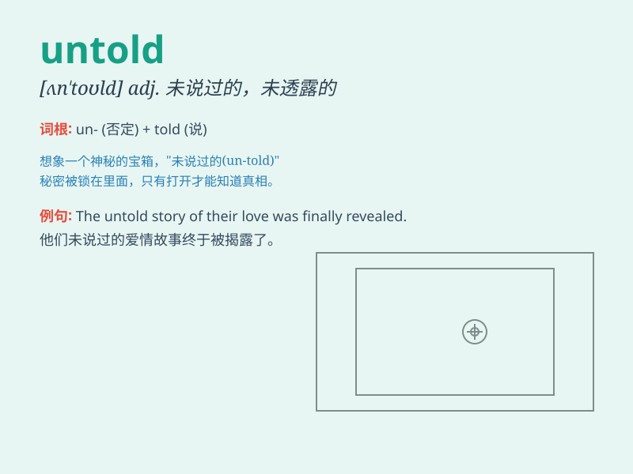

## untold

**英音:** _[ʌn\'təʊld]_ **美音:** _[,ʌn\'told]_

**译义:** *adj.未说过的,未透露的,数不清的*

### 短语

+ **untold damage:** _极大的损害_

+ **untold wealth:** _巨额财富_

+ **untold stories:** _不为人知的故事_

+ **untold suffering:** _无尽的痛苦_

+ **untold secrets:** _未透露的秘密_

### 例句

#### 例句1

> **The disaster caused untold suffering to the people.**

**中文翻译:** 这场灾难给人们带来了无尽的痛苦。

**单词释义:** 无数的；数不清的

#### 例句2

> **There are untold stories of heroism during the war.**

**中文翻译:** 战争期间有无数英勇的故事。

**单词释义:** 无数的；数不清的

#### 例句3

> **The project has cost an untold amount of money.**

**中文翻译:** 这个项目花费了数不清的钱。

**单词释义:** 难以估量的；无数的

### 背诵小故事

> In a faraway kingdom, there was an ancient library filled with untold
secrets. One brave scholar ventured in, determined to uncover the hidden
knowledge within. These secrets were countless and unknown, just like
the meaning of \'untold\'.

**在一个遥远的王国，有一个古老的图书馆，里面充满了数不清的秘密。一位勇敢的学者冒险进入，决心揭开其中隐藏的知识。这些秘密不计其数且不为人知，就像\'untold\'的意思一样。**

### 图义

