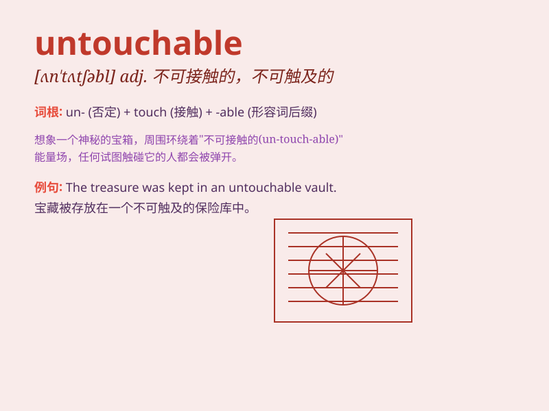

## untouchable

**英音:** _[ʌn\'tʌtʃəb(ə)l]_ **美音:** _[ʌn\'tʌtʃəbl]_

**译义:** *n.贱民adj.禁止触摸的,管不着的,独特的,不可及的*

### 短语

+ **untouchable caste:** _不可接触的种姓_

+ **untouchable status:** _不可触及的地位_

+ **remain untouchable:** _保持不可触碰_

+ **seem untouchable:** _看起来不可触摸_

+ **become untouchable:** _变得不可触摸_

### 例句

#### 例句1

> **The law should be fair and not create any untouchable
classes.**

**中文翻译:** 法律应当是公平的，不应该创造出任何不可触碰的阶层。

**单词释义:** 不可触碰的；不可动摇的

#### 例句2

> **In this game, some areas are marked as untouchable.**

**中文翻译:** 在这个游戏中，有些区域被标记为不可触碰的。

**单词释义:** 不可触碰的；禁止接触的

#### 例句3

> **The problem seemed untouchable until they found a creative
solution.**

**中文翻译:** 这个问题似乎难以解决，直到他们找到了一个有创意的办法。

**单词释义:** 难以解决的；棘手的

### 背诵小故事

> Once upon a time, there was a mysterious treasure chest that was
untouchable. No one could get close to it. It was protected by powerful
magic. But one brave adventurer finally found the key to unlock its
secrets.

**从前，有一个神秘的宝箱是碰不得的。没人能接近它。它被强大的魔法保护着。但一位勇敢的冒险家最终找到了揭开其秘密的钥匙。**

### 图义

