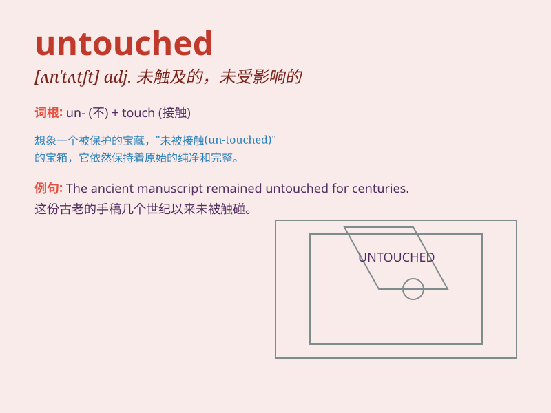

## untouched

**英音:** _[ʌn\'tʌtʃt]_ **美音:** _[ʌn\'tʌtʃt]_

**译义:** *adj.未触及的,未改变的,不受感动的,无与伦比的*

### 短语

+ **untouched area:** _未触及的区域；未受影响的地区_

+ **remain untouched:** _保持未被触动；维持原状_

+ **untouched beauty:** _未被破坏的美；原封未动的美_

+ **untouched food:** _未动过的食物_

+ **untouched emotion:** _未触动的情感；未受影响的情绪_

### 例句

#### 例句1

> **The untouched forest was a haven for rare species.**

**中文翻译:** 这片未被触及的森林是珍稀物种的庇护所。

**单词释义:** 未被触及的；未受影响的

#### 例句2

> **The untouched food on the plate suggested that he wasn\'t
hungry.**

**中文翻译:** 盘子里未动过的食物表明他不饿。

**单词释义:** 未被碰过的；未被处理的

#### 例句3

> **Her untouched beauty left everyone speechless.**

**中文翻译:** 她未经修饰的美丽让每个人都惊叹不已。

**单词释义:** 未经修饰的；原封未动的

### 背诵小故事

> In a hidden forest, there was a magical cave. No one had ever entered
it, and it remained untouched. It was like a secret world waiting to be
discovered. The untouched cave was full of mystery and wonder.

**在一片隐秘的森林里，有一个神奇的洞穴。从来没有人进去过，它一直未被触碰。它就像一个等待被发现的秘密世界。这个未被触碰的洞穴充满了神秘和奇妙。**

### 图义

