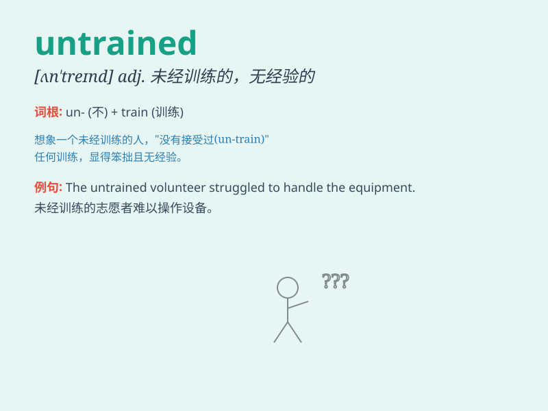

## untrained

**英音:** _[ʌn\'treɪnd]_ **美音:** _[,ʌn\'trend]_

**译义:** *adj.未经训练的*

### 短语

+ **untrained eye:** _未经训练的眼睛；外行的眼光_

+ **untrained staff:** _未经培训的员工_

+ **untrained workforce:** _未经训练的劳动力_

+ **untrained mind:** _未经训练的思维_

+ **untrained athlete:** _未经训练的运动员_

### 例句

#### 例句1

> **The untrained dog was difficult to control.**

**中文翻译:** 这只未经训练的狗很难控制。

**单词释义:** 未经训练的

#### 例句2

> **He is an untrained athlete but shows great potential.**

**中文翻译:** 他是一名未经训练的运动员，但展现出了巨大的潜力。

**单词释义:** 未经训练的

#### 例句3

> **The untrained workers made many mistakes in the production
line.**

**中文翻译:** 未经培训的工人在生产线上犯了很多错误。

**单词释义:** 未经培训的

### 背诵小故事

> A young man wanted to be a chef but was untrained. He faced many
difficulties in the kitchen. However, with determination, he learned and
practiced, and finally became an excellent chef.

**一个年轻人想成为厨师但未经训练。他在厨房面临许多困难。然而，凭借决心，他学习和练习，最终成为了一名出色的厨师。**

### 图义

