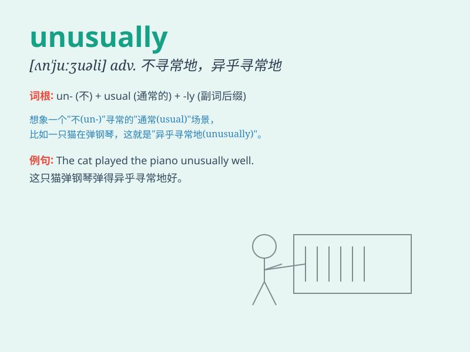

## unusually

**英音:** _[ʌn\'ju:ʒuəlɪ]_ **美音:** _[ʌn\'juʒuəli]_

**译义:** *adv.显著地,异乎寻常地,罕有地*

### 短语

+ **unusually cold:** _异常寒冷_

+ **unusually quiet:** _异常安静_

+ **unusually busy:** _异常忙碌_

+ **unusually difficult:** _异常困难_

+ **unusually early:** _异常早_

### 例句

#### 例句1

> **It is unusually hot today.**

**中文翻译:** 今天异常地热。

**单词释义:** 异常地；特别地

#### 例句2

> **She was unusually quiet at the party.**

**中文翻译:** 她在聚会上异常地安静。

**单词释义:** 异乎寻常地；不寻常地

#### 例句3

> **This problem is unusually difficult to solve.**

**中文翻译:** 这个问题异常难以解决。

**单词释义:** 特别；极其

### 背诵小故事

> One day, I went to a park. Everyone was behaving normally. But there
was a girl who danced unusually beautifully. Her moves were so unique
and eye-catching. It made me remember \'unusually\' easily.

**有一天，我去了一个公园。每个人表现都很正常。但有一个女孩跳舞异常地美。她的动作如此独特和引人注目。这让我轻松记住了\'unusually\'。**

### 图义

