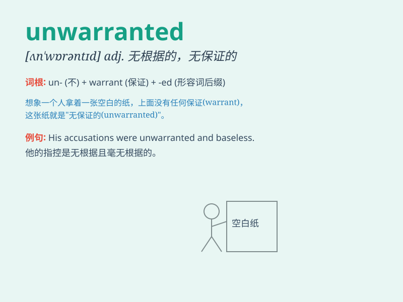

## unwarranted

**英音:** _[ʌn\'wɒr(ə)ntɪd]_ **美音:** _[ʌn\'wɔrəntɪd]_

**译义:** *adj.无根据的,未获保证的,无保证的,未获承认的*

### 短语

+ **unwarranted interference:** _无端的干涉_

+ **unwarranted assumption:** _无根据的假设_

+ **unwarranted criticism:** _不合理的批评_

+ **unwarranted optimism:** _盲目的乐观_

+ **unwarranted attack:** _无端的攻击_

### 例句

#### 例句1

> **The criticism he received was completely unwarranted.**

**中文翻译:** 他受到的批评完全是没有根据的。

**单词释义:** 没有根据的；无正当理由的

#### 例句2

> **Such an unwarranted assumption could lead to wrong decisions.**

**中文翻译:** 这样一个无根据的假设可能会导致错误的决定。

**单词释义:** 无根据的；无正当理由的

#### 例句3

> **The police action was considered unwarranted by many
citizens.**

**中文翻译:** 许多市民认为警方的行动是没有正当理由的。

**单词释义:** 没有正当理由的

### 背诵小故事

> A detective was investigating a case. He found some evidence that
seemed to point to a suspect, but later discovered it was unwarranted.
The real criminal was someone else. It means not justified or having no
good reason.

**一位侦探在调查一个案子。他发现了一些似乎指向一名嫌疑人的证据，但后来发现这是没有根据的。真正的罪犯是其他人。这个词意思是无正当理由的、未经授权的。**

### 图义

