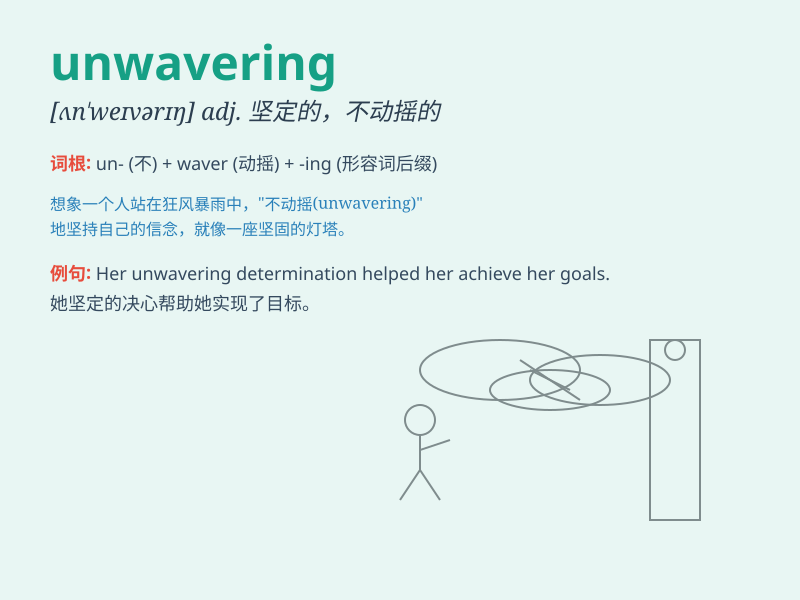

## unwavering

**英音:** _[ʌn\'weɪv(ə)rɪŋ]_ **美音:** _[ʌn\'wevərɪŋ]_

**译义:** *adj.不动摇的,坚定的*

### 短语

+ **unwavering support:** _坚定不移的支持_

+ **unwavering commitment:** _毫不动摇的承诺_

+ **unwavering determination:** _坚定不移的决心_

+ **unwavering faith:** _毫不动摇的信念_

+ **unwavering loyalty:** _坚定不移的忠诚_

### 例句

#### 例句1

> **His unwavering determination led him to success.**

**中文翻译:** 他坚定不移的决心使他走向成功。

**单词释义:** 坚定不移的

#### 例句2

> **She showed unwavering support for her friend during difficult
times.**

**中文翻译:** 在困难时期，她对朋友表现出毫不动摇的支持。

**单词释义:** 毫不动摇的

#### 例句3

> **The soldier\'s unwavering loyalty to his country was
commendable.**

**中文翻译:** 这位士兵对国家的坚定忠诚值得称赞。

**单词释义:** 坚定的

### 背诵小故事

> A soldier was on a dangerous mission. Despite facing many
difficulties and fears, his determination was unwavering. He never
wavered in his commitment to complete the task and finally succeeded.

**一名士兵在执行一项危险的任务。尽管面临诸多困难和恐惧，但他的决心坚定不移。他完成任务的信念从未动摇，最终成功了。**

### 图义

