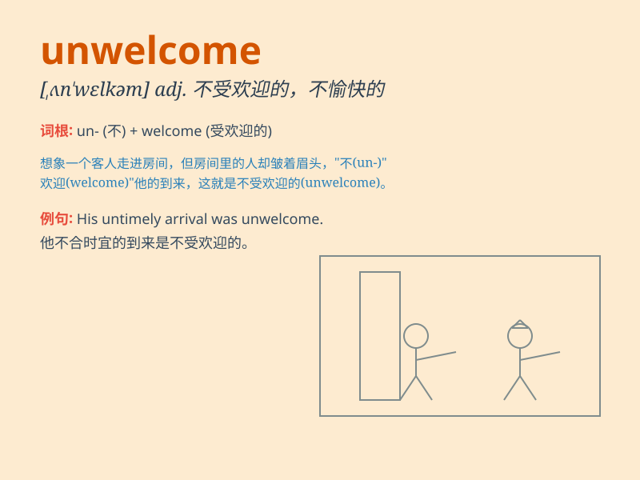

## unwelcome

**英音:** _[ʌn\'welkəm]_ **美音:** _[ʌn\'wɛlkəm]_

**译义:** *adj.不受欢迎的,讨厌的*

### 短语

+ **be unwelcome:** _不受欢迎_

+ **find oneself unwelcome:** _发现自己不受欢迎_

+ **an unwelcome guest:** _一位不受欢迎的客人_

+ **unwelcome news:** _不受欢迎的消息_

+ **unwelcome interference:** _不受欢迎的干涉_

### 例句

#### 例句1

> **His presence at the party was unwelcome.**

**中文翻译:** 他在聚会上的出现不受欢迎。

**单词释义:** 不受欢迎的

#### 例句2

> **The unwelcome news made her sad.**

**中文翻译:** 这个不受欢迎的消息让她伤心。

**单词释义:** 不受欢迎的

#### 例句3

> **We received an unwelcome visit from the tax inspector.**

**中文翻译:** 我们受到了税务稽查员不受欢迎的拜访。

**单词释义:** 不受欢迎的

### 背诵小故事

> One day, a strange man came to the village. Everyone felt his arrival
was unwelcome. He was rude and caused trouble. No one wanted him to
stay. So, unwelcome means not wanted or pleasant.

**有一天，一个陌生男人来到了村子。每个人都觉得他的到来不受欢迎。他很粗鲁还惹麻烦。没人希望他留下来。所以，unwelcome
意思是不受欢迎的、不令人愉快的。**

### 图义

