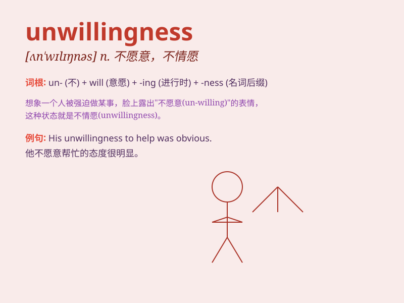

## unwillingness

**英音:** _[ʌn\'wɪlɪŋnəs]_ **美音:** _[ʌn\'wɪlɪŋnəs]_

**译义:** *n.不愿意,不情愿*

### 短语

+ **show unwillingness:** _表现出不情愿_

+ **express unwillingness:** _表达不情愿_

+ **feel unwillingness:** _感到不情愿_

+ **overcome unwillingness:** _克服不情愿_

+ **understand unwillingness:** _理解不情愿_

### 例句

#### 例句1

> **His unwillingness to compromise led to the breakdown of the
negotiations.**

**中文翻译:** 他不愿意妥协导致了谈判的破裂。

**单词释义:** 不愿意，不情愿

#### 例句2

> **I was frustrated by her unwillingness to listen to my advice.**

**中文翻译:** 我对她不愿意听我的建议感到沮丧。

**单词释义:** 不愿意，不想

#### 例句3

> **The project was delayed due to the workers\' unwillingness to
work overtime.**

**中文翻译:** 这个项目因为工人们不愿意加班而被推迟了。

**单词释义:** 不愿意，不乐意

### 背诵小故事

> Once there was a king. He was faced with a difficult decision but
showed unwillingness to make it. His subjects were confused. This
unwillingness caused chaos in the kingdom.

**从前有一位国王。他面临一个艰难的决定，但表现出不情愿去做。他的臣民们很困惑。这种不情愿在王国里引起了混乱。**

### 图义

