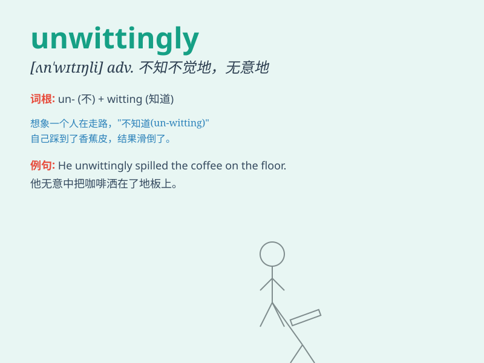

## unwittingly

**英音:** _[ʌnˈwɪtɪŋli]_ **美音:** _[ʌnˈwɪtɪŋli]_

**译义:** *adv.不知情地,无意地*

### 短语

+ **act unwittingly:** _无意地行动_

+ **speak unwittingly:** _不经意地说话_

+ **make a mistake unwittingly:** _无意地犯错_

+ **fall into a trap unwittingly:** _不知不觉地落入陷阱_

+ **reveal the secret unwittingly:** _无意地泄露秘密_

### 例句

#### 例句1

> **He unwittingly revealed his secret during the conversation.**

**中文翻译:** 他在谈话中不知不觉地泄露了自己的秘密。

**单词释义:** 不知不觉地；无意地

#### 例句2

> **She unwittingly caused a lot of trouble for her friends.**

**中文翻译:** 她无意中给她的朋友们带来了很多麻烦。

**单词释义:** 无意地；不经意地

#### 例句3

> **They unwittingly entered a restricted area.**

**中文翻译:** 他们不知不觉地进入了一个禁区。

**单词释义:** 不知不觉地

### 背诵小故事

> A detective was investigating a crime. A witness unwittingly provided
a crucial clue by mentioning a detail she didn\'t realize was important.
The detective followed this and solved the case.

**一位侦探正在调查一起犯罪案件。一位证人在不经意间提供了一条关键线索，她当时并未意识到这个细节的重要性。侦探顺着这条线索破了案。**

### 图义

