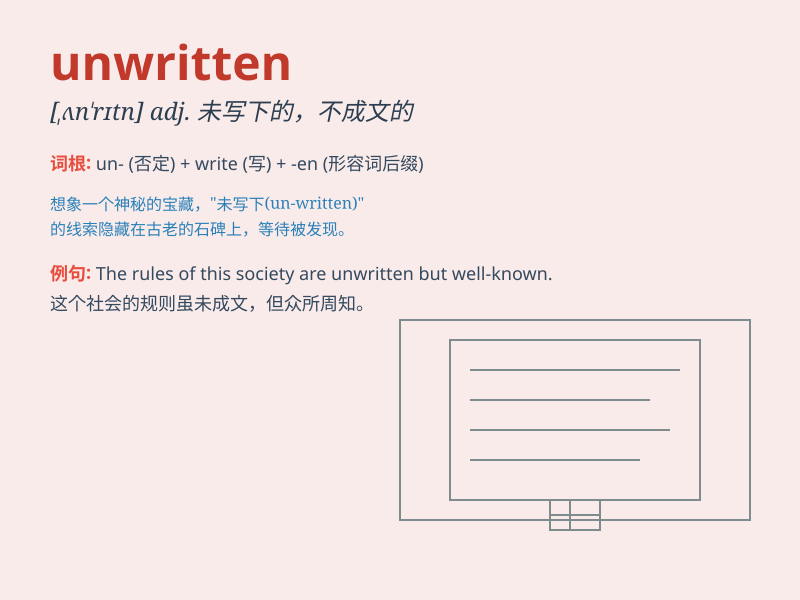

## unwritten

**英音:** _[ʌn\'rɪt(ə)n]_ **美音:** _[,ʌn\'rɪtn]_

**译义:** *adj.未成文的,口头的,没有记录的,不成文的*

### 短语

+ **unwritten law:** _不成文法；习惯法_

+ **unwritten agreement:** _口头协议；未书面记录的协议_

+ **unwritten constitution:** _不成文宪法_

+ **unwritten rule:** _不成文的规定；潜规则_

+ **unwritten history:** _未被记载的历史_

### 例句

#### 例句1

> **The unwritten rules of the club are known only to the
members.**

**中文翻译:** 俱乐部不成文的规定只有会员知道。

**单词释义:** 未成文的；不成文的

#### 例句2

> **Her story remains unwritten; it\'s waiting for the right author
to bring it to life.**

**中文翻译:** 她的故事仍未被书写；正等待合适的作者将其呈现。

**单词释义:** 未写的；未记录的

#### 例句3

> **The unwritten history of this small town is full of
mysteries.**

**中文翻译:** 这个小镇未被书写的历史充满了神秘。

**单词释义:** 未被记录的；未书写的

### 背诵小故事

>
想象一个古老的图书馆，里面有一本神秘的魔法书，它的内容是空白的，没有被书写过，即
unwritten。就像未被记录的秘密，等待着被揭示。

**想象一个古老图书馆里有本空白的魔法书，就像未被书写的秘密，以此来记
unwritten 这个单词**

### 图义

