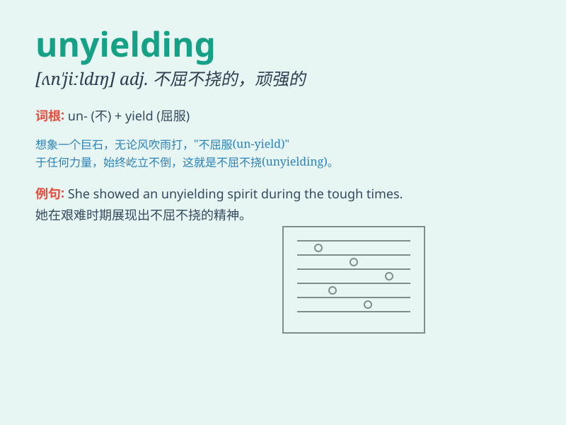

## unyielding

**英音:** _[ʌn\'jiːldɪŋ]_ **美音:** _[ʌn\'jildɪŋ]_

**译义:** *adj.坚硬的,不能弯曲的,不屈的*

### 短语

+ **unyielding support:** _坚定不移的支持_

+ **unyielding spirit:** _不屈不挠的精神_

+ **unyielding determination:** _毫不动摇的决心_

+ **unyielding attitude:** _坚决的态度_

+ **unyielding resistance:** _顽强的抵抗_

### 例句

#### 例句1

> **She showed unyielding determination in the face of
difficulties.**

**中文翻译:** 她在困难面前表现出坚定不移的决心。

**单词释义:** 坚定不移的；不屈服的

#### 例句2

> **The unyielding rock resisted the force of the waves for
centuries.**

**中文翻译:** 这块坚硬的岩石数百年来抵御着海浪的冲击。

**单词释义:** 坚固的；不易弯曲的

#### 例句3

> **His unyielding attitude caused a lot of problems in the
negotiation.**

**中文翻译:** 他坚决不让步的态度在谈判中引发了很多问题。

**单词释义:** 不让步的；不妥协的

### 背诵小故事

> A warrior was in a fierce battle. Despite the enemy\'s strong
attacks, he remained unyielding. He wouldn\'t give up or surrender,
showing great determination. Just like this warrior, unyielding means
being firm and not giving in easily.

**一位战士身处激烈的战斗中。尽管敌人猛烈攻击，他依然坚定不移。他绝不放弃或投降，展现出极大的决心。就像这位战士一样，unyielding
意思是坚定的，不容易屈服。**

### 图义

