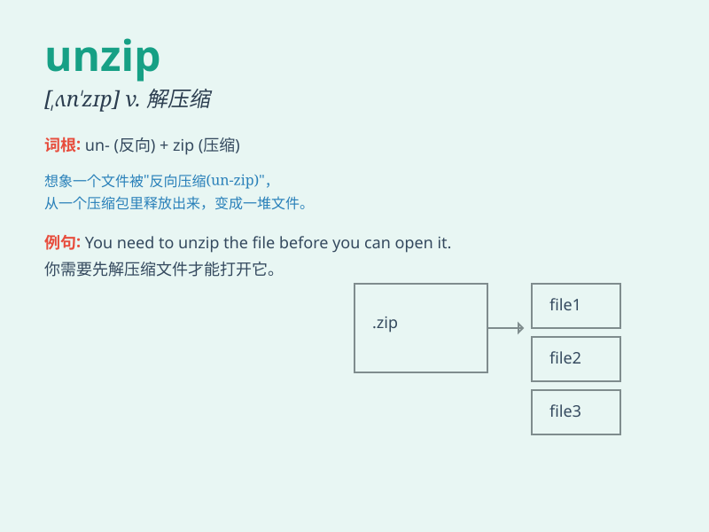

## unzip

**英音:** _[ʌn\'zɪp]_ **美音:** _[,ʌn\'zɪp]_

**译义:** *vi.拉开拉链vt.拉开*

### 短语

+ **unzip a file:** _解压一个文件_

+ **unzip the package:** _解开包裹_

+ **unzip the folder:** _解压文件夹_

+ **unzip the archive:** _解压档案_

+ **unzip the compressed data:** _解压压缩数据_

### 例句

#### 例句1

> **Please unzip the file before opening it.**

**中文翻译:** 在打开文件之前，请先解压缩它。

**单词释义:** 解压缩

#### 例句2

> **I need to unzip this package to get the documents inside.**

**中文翻译:** 我需要解压这个包裹以获取里面的文件。

**单词释义:** 解压

#### 例句3

> **He quickly unzipped his backpack to find the map.**

**中文翻译:** 他迅速拉开他背包的拉链以找到地图。

**单词释义:** 拉开（拉链）

### 背诵小故事

> One day, I received a mysterious package. It was zipped tightly. But
I was eager to know what was inside, so I decided to unzip it. With
great excitement, I opened it and found a wonderful surprise!

**有一天，我收到了一个神秘的包裹。它被紧紧地拉上了拉链。但我急切地想知道里面是什么，所以我决定拉开拉链。怀着极大的兴奋，我打开了它，发现了一个美妙的惊喜！**

### 图义

