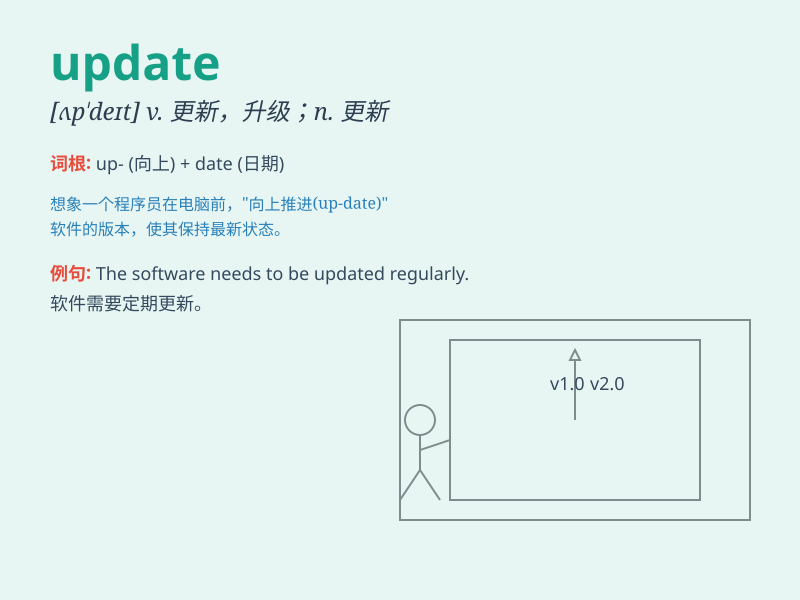

## update

**英音:** _[ʌp\'deɪt]_ **美音:** _[,ʌp\'det]_

**译义:** *v.使现代化,修正,校正,更新n.现代化,更新*

### 短语

+ **update information:** _更新信息_

+ **update software:** _更新软件_

+ **update database:** _更新数据库_

+ **update status:** _更新状态_

+ **update knowledge:** _更新知识_

### 例句

#### 例句1

> **Please update the software to the latest version.**

**中文翻译:** 请将软件更新到最新版本。

**单词释义:** 更新

#### 例句2

> **I need to update my resume before applying for the job.**

**中文翻译:** 在申请这份工作之前，我需要更新我的简历。

**单词释义:** 更新；修改

#### 例句3

> **The manager asked us to update him on the progress of the
project.**

**中文翻译:** 经理要求我们向他汇报项目的进展情况。

**单词释义:** 向......提供最新信息

### 背诵小故事

>
想象一个古老的图书馆，里面的书籍信息过时了。一位勤奋的管理员每天努力工作，将新的知识和信息添加到书籍中，这就是\'update\'，让图书馆的内容始终保持最新。

**想象一个古老图书馆，管理员努力添加新知识和信息以保持内容最新的过程，就是\'更新\'的意思。**

### 图义

