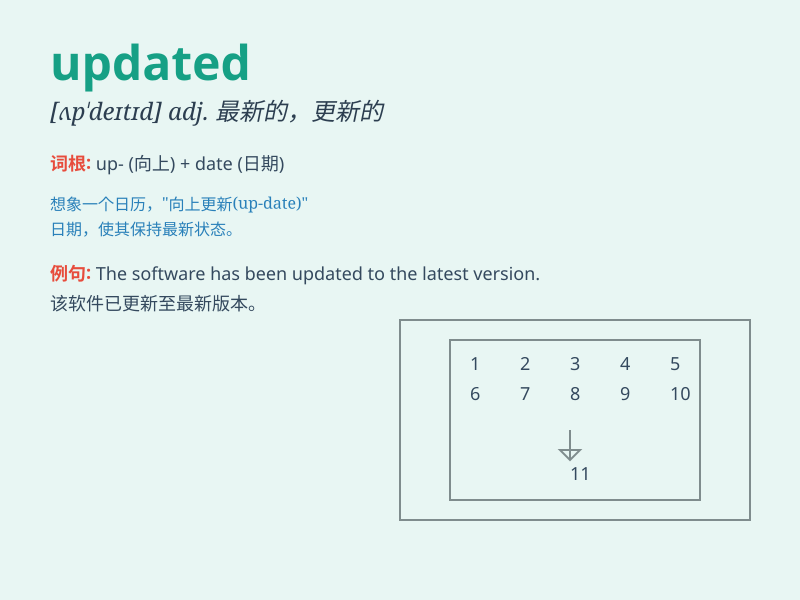

## updated

**英音:** _null_ **美音:** _null_

**译义:** *null*

### 短语

+ **updated information:** _更新的信息_

+ **updated version:** _更新版本_

+ **keep updated:** _保持更新_

+ **updated regularly:** _定期更新_

+ **be updated with:** _用\...\...更新_

### 例句

#### 例句1

> **The software has been updated to the latest version.**

**中文翻译:** 这个软件已经被更新到了最新版本。

**单词释义:** 更新

#### 例句2

> **I need to updated my resume before applying for the job.**

**中文翻译:** 在申请这份工作之前，我需要更新我的简历。

**单词释义:** 更新

#### 例句3

> **The updated information is now available on the website.**

**中文翻译:** 更新后的信息现在在网站上可以获取。

**单词释义:** 更新的

### 背诵小故事

> A scientist was working on a project. His data was old and incorrect.
So, he spent days making it updated. With the updated information, he
finally made a great discovery.

**一位科学家正在进行一个项目。他的数据陈旧且不正确。所以，他花了几天时间使其更新。凭借更新后的信息，他终于有了重大发现。**

### 图义

