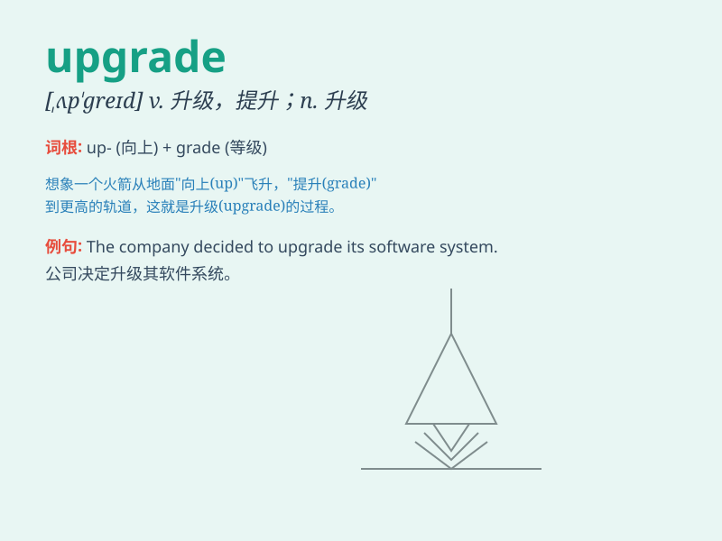

## upgrade

**英音:** _[ʌp\'greɪd]_ **美音:** _[,ʌp\'ɡred]_

**译义:** *n.升级,上升,上坡adv.往上vt.使升级,提升,改良品种*

### 短语

+ **upgrade to:** _升级到_

+ **upgrade from:** _从\...\...升级_

+ **system upgrade:** _系统升级_

+ **software upgrade:** _软件升级_

+ **equipment upgrade:** _设备升级_

### 例句

#### 例句1

> **I decided to upgrade my computer to improve its performance.**

**中文翻译:** 我决定升级我的电脑以提高其性能。

**单词释义:** 升级；提高

#### 例句2

> **The airline upgraded him to first class because of the
overbooking.**

**中文翻译:** 由于超额预订，航空公司把他升级到头等舱。

**单词释义:** 提升；使升级

#### 例句3

> **This software needs to be upgraded regularly to fix bugs.**

**中文翻译:** 这个软件需要定期升级以修复漏洞。

**单词释义:** 升级；更新

### 背诵小故事

> A poor student had an old computer. But he worked hard and saved
money to upgrade it. With the upgraded computer, his study became more
efficient.

**一个贫困的学生有一台旧电脑。但他努力工作存钱来升级它。有了升级后的电脑，他的学习变得更高效了。**

### 图义

