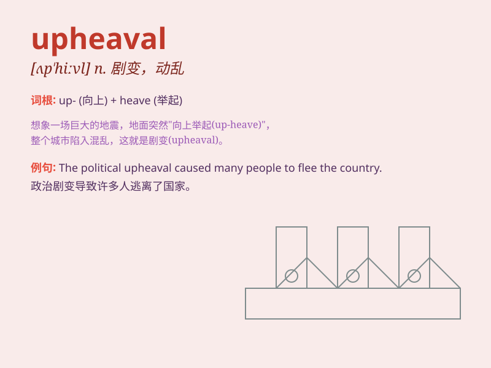

## upheaval

**英音:** _[ʌp\'hiːv(ə)l]_ **美音:** _[ʌp\'hivl]_

**译义:** *n.剧变*

### 短语

+ **political upheaval:** _政治动荡_

+ **social upheaval:** _社会剧变_

+ **economic upheaval:** _经济动荡_

+ **major upheaval:** _重大动荡_

+ **sudden upheaval:** _突然的剧变_

### 例句

#### 例句1

> **The country is going through an economic upheaval.**

**中文翻译:** 这个国家正在经历一场经济动荡。

**单词释义:** 剧变；动荡

#### 例句2

> **The upheaval in the company led to many layoffs.**

**中文翻译:** 公司的剧变导致了许多裁员。

**单词释义:** 大变动；动乱

#### 例句3

> **The political upheaval changed the course of history.**

**中文翻译:** 这场政治动荡改变了历史的进程。

**单词释义:** 动乱；激变

### 背诵小故事

> Imagine a peaceful town. One day, a huge earthquake strikes, causing
buildings to collapse and roads to break. This sudden and violent change
is like an \'upheaval\'. It brings chaos and turns everything upside
down.

**想象一个宁静的小镇。有一天，一场巨大的地震来袭，导致建筑物倒塌，道路断裂。这种突然而剧烈的变化就像是'剧变；动乱'。它带来混乱，让一切都天翻地覆。**

### 图义

