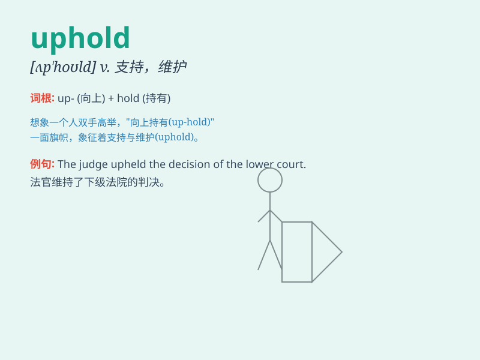

## uphold

**英音:** _[ʌp\'həʊld]_ **美音:** _[ʌpˈhoʊld]_

**译义:** *vt.支持,赞成*

### 短语

+ **uphold justice:** _维护正义_

+ **uphold the law:** _维护法律_

+ **uphold a decision:** _支持一个决定_

+ **uphold a principle:** _坚持原则_

+ **uphold rights:** _维护权利_

### 例句

#### 例句1

> **The court is expected to uphold the law.**

**中文翻译:** 预计法院会维护法律。

**单词释义:** 维护；支持

#### 例句2

> **We have a duty to uphold justice.**

**中文翻译:** 我们有责任维护正义。

**单词释义:** 维护；支持

#### 例句3

> **The judge upheld the original verdict.**

**中文翻译:** 法官维持原判。

**单词释义:** 维持；确认

### 背诵小故事

> A judge must uphold the law. Imagine a judge standing firm in court,
holding up the heavy book of law, determined not to let it fall. That\'s
how we remember \'uphold\' means to support or maintain.

**一位法官必须维护法律。想象一位法官在法庭上坚定地站着，举起厚重的法典，决心不让它掉落。这就是我们记住'uphold'表示支持或维护的方式。**

### 图义

