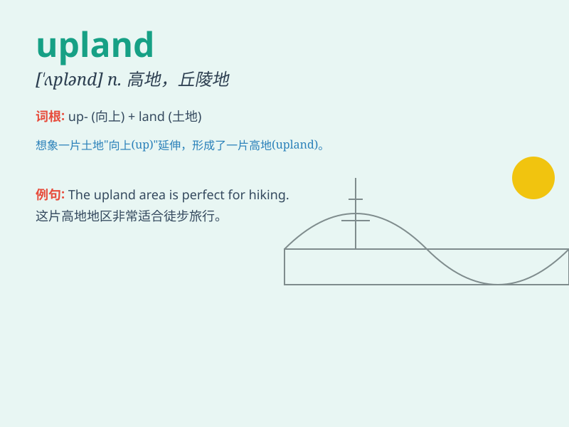

## upland

**英音:** _[\'ʌplənd]_ **美音:** _[\'ʌplənd]_

**译义:** *n.丘陵地,高地,丘阜adj.高地的,山地的*

### 短语

+ **upland field:** _高地农田_

+ **upland area:** _高地地区_

+ **upland climate:** _高地气候_

+ **upland forest:** _高地森林_

+ **upland village:** _高地村庄_

### 例句

#### 例句1

> **The farmer has a large plot of upland for growing crops.**

**中文翻译:** 这位农民有一大片高地用于种植庄稼。

**单词释义:** 高地

#### 例句2

> **They went hiking in the upland area last weekend.**

**中文翻译:** 他们上周末去高地地区徒步旅行了。

**单词释义:** 高地

#### 例句3

> **The upland is rich in natural resources.**

**中文翻译:** 这片高地自然资源丰富。

**单词释义:** 高地

### 背诵小故事

> A brave adventurer climbed the high mountains and reached the upland.
There, he found beautiful flowers and a peaceful view. The upland was
like a hidden paradise.

**一位勇敢的冒险家爬上了高山，到达了高地。在那里，他发现了美丽的花朵和宁静的景色。高地就像一个隐藏的天堂。**

### 图义

