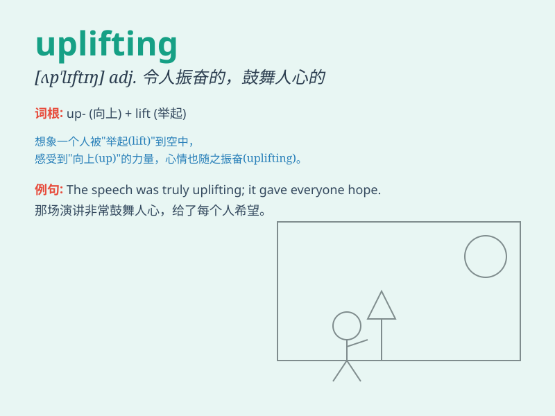

## uplifting

**英音:** _[ʌpˈlɪftɪŋ]_ **美音:** _[ʌpˈlɪftɪŋ]_

**译义:** *adj. 令人振奋的；鼓舞人心的；提升的；振奋精神的*

### 短语

+ **uplifting music:** _令人振奋的音乐_

+ **uplifting experience:** _令人鼓舞的经历_

+ **uplifting story:** _振奋人心的故事_

+ **uplifting message:** _鼓舞人心的信息_

+ **uplifting atmosphere:** _令人振奋的氛围_

### 例句

#### 例句1

> **The music was very uplifting and made me feel happy.**

**中文翻译:** 这首音乐非常振奋人心，让我感到开心。

**单词释义:** 令人振奋的；鼓舞人心的

#### 例句2

> **She shared an uplifting story that inspired everyone.**

**中文翻译:** 她分享了一个鼓舞人心的故事，激励了每个人。

**单词释义:** 鼓舞人心的

#### 例句3

> **The uplifting message gave him the strength to move forward.**

**中文翻译:** 这个令人振奋的消息给了他前进的力量。

**单词释义:** 令人振奋的

### 背诵小故事

>
想象你在黑暗的山谷中迷失，心情低落。突然，一只彩色的热气球出现，缓缓升起，带你飞向光明。这股向上的力量让你精神振奋，这种令人精神振奋的感觉就是uplifting。

**想象在黑暗山谷中因热气球升起而精神振奋的情景来理解uplifting（令人振奋的；鼓舞人心的）**

### 图义

