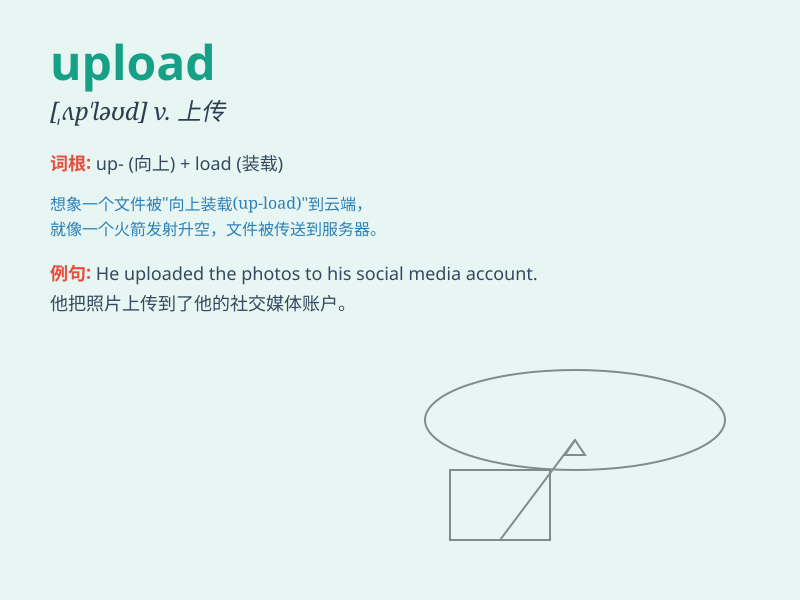

## upload

**英音:** _[ʌp\'ləʊd]_ **美音:** _[,ʌp\'lod]_

**译义:** *上载*

### 短语

+ **upload files:** _上传文件_

+ **upload data:** _上传数据_

+ **upload images:** _上传图片_

+ **upload videos:** _上传视频_

+ **upload information:** _上传信息_

### 例句

#### 例句1

> **I need to upload these photos to my social media account.**

**中文翻译:** 我需要把这些照片上传到我的社交媒体账号。

**单词释义:** 上传

#### 例句2

> **The company uploads new products to its website every month.**

**中文翻译:** 这家公司每个月都会把新产品上传到它的网站上。

**单词释义:** 上传

#### 例句3

> **She spent hours uploading videos to the video-sharing
platform.**

**中文翻译:** 她花了好几个小时向视频分享平台上传视频。

**单词释义:** 上传

### 背诵小故事

> One day, Tom had many beautiful photos on his computer. He wanted to
share them with his friends. So he used a special website to upload
these photos. That way, everyone could see them.

**一天，汤姆电脑里有很多漂亮的照片。他想和朋友们分享。于是他使用一个特殊的网站上传这些照片。这样，每个人都能看到了。**

### 图义

