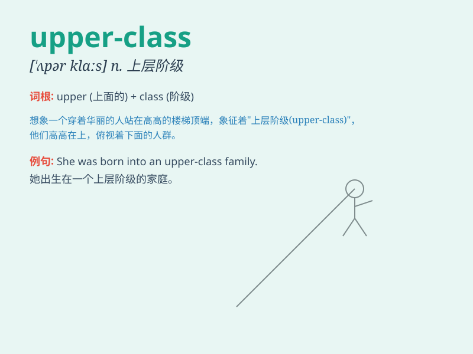

## upper-class

**英音:** _[ˌʌpə ˈklɑːs]_ **美音:** _[ˌʌpər ˈklæs]_

**译义:** *adj.上流社会的；上层阶级的；上层的*

### 短语

+ **upper-class society:** _上层社会_

+ **upper-class family:** _上层阶级家庭_

+ **upper-class background:** _上层阶级背景_

+ **upper-class lifestyle:** _上层阶级的生活方式_

+ **upper-class education:** _上层阶级的教育_

### 例句

#### 例句1

> **The upper-class families often attend exclusive social
events.**

**中文翻译:** 上层阶级的家庭经常参加专属的社交活动。

**单词释义:** 上层阶级的

#### 例句2

> **She has an upper-class accent.**

**中文翻译:** 她有上层阶级的口音。

**单词释义:** 上层阶级的

#### 例句3

> **The upper-class lifestyle is beyond the reach of most people.**

**中文翻译:** 上层阶级的生活方式是大多数人无法企及的。

**单词释义:** 上层阶级的

### 背诵小故事

> Once upon a time, a prince lived in an upper-class castle. He had
everything luxurious. But he was lonely. Then he met a commoner and
learned true friendship. \'Upper-class\' means belonging to the highest
social class with great wealth and privilege.

**从前，有一位王子住在一个上层阶级的城堡里。他拥有一切奢华的东西。但他很孤独。然后他遇到了一个平民，并学到了真正的友谊。\'upper-class\'意思是属于具有大量财富和特权的最高社会阶层。**

### 图义

