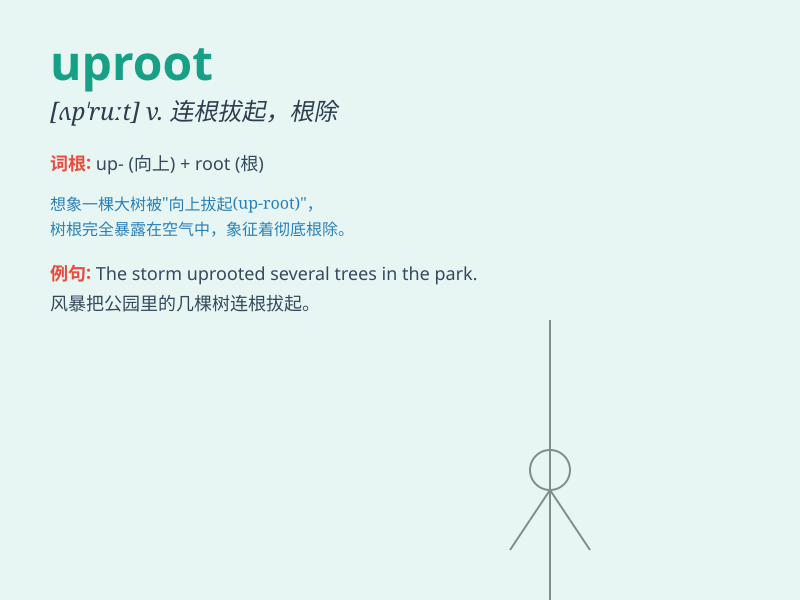

## uproot

**英音:** _[ʌp\'ruːt]_ **美音:** _[,ʌp\'rut]_

**译义:** *vt.连根拔起,根除*

### 短语

+ **uproot oneself:** _离开家乡；背井离乡_

+ **uproot a tree:** _把树连根拔起_

+ **uproot evil:** _根除邪恶_

+ **uproot a habit:** _改掉一个习惯_

+ **uproot traditions:** _破除传统_

### 例句

#### 例句1

> **The storm uprooted many trees.**

**中文翻译:** 这场风暴把许多树连根拔起。

**单词释义:** 连根拔起

#### 例句2

> **They had to uproot their family and move to a new city for
work.**

**中文翻译:** 他们不得不举家搬迁到一个新的城市去工作。

**单词释义:** 使离开家园

#### 例句3

> **The new policy may uproot some traditional practices.**

**中文翻译:** 新政策可能会颠覆一些传统做法。

**单词释义:** 彻底消除；颠覆

### 背诵小故事

> A strong wind came and uprooted the old tree in the forest. The tree
that had stood for years was suddenly pulled out of the ground. Poor
tree! Now you know \'uproot\' means to pull something out of the ground
completely.

**一阵强风袭来，把森林里的那棵老树连根拔起。这棵屹立多年的树突然就被完全从地里拔了出来。可怜的树！现在你知道\'uproot\'意思是把某物从地里完全拔出。**

### 图义

