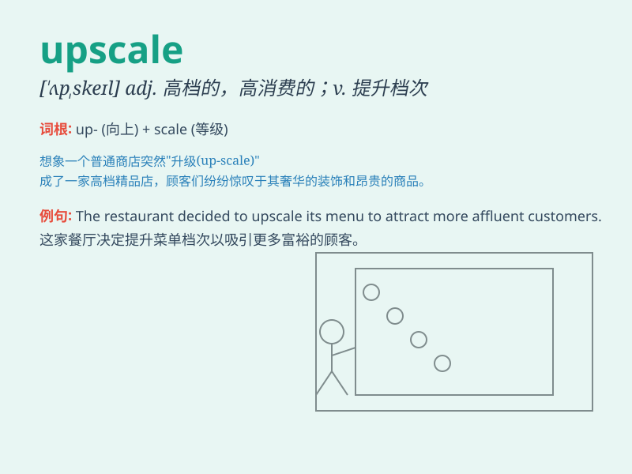

## upscale

**英音:** _[ˌʌpˈskeɪl]_ **美音:** _[ˌʌpˈskeɪl]_

**译义:**
*adj.\<美>高消费阶层的,迎合高层次消费者的,(商品)质优价高的*

### 短语

+ **upscale neighborhood:** _高档社区_

+ **upscale market:** _高端市场_

+ **upscale restaurant:** _高级餐厅_

+ **upscale hotel:** _高档酒店_

+ **upscale brand:** _高端品牌_

### 例句

#### 例句1

> **The new shopping mall is very upscale, with high-end stores and
luxurious decorations.**

**中文翻译:** 新的购物中心非常高档，有高端商店和豪华的装饰。

**单词释义:** 高档的；高级的

#### 例句2

> **They decided to move to an upscale neighborhood for a better
living environment.**

**中文翻译:** 他们决定搬到一个高档社区以获得更好的生活环境。

**单词释义:** 高档的；高级的

#### 例句3

> **This upscale restaurant offers exquisite cuisine and top-notch
service.**

**中文翻译:** 这家高档餐厅提供精致的美食和一流的服务。

**单词释义:** 高档的；高级的

### 背诵小故事

> A poor artist dreamed of having an upscale life. One day, he sold a
masterpiece and moved to a fancy neighborhood. Now he lived an upscale
life with fine art and elegant furniture.

**一位贫穷的艺术家梦想过上高档的生活。有一天，他卖掉了一幅杰作，搬到了一个高档社区。现在他过上了拥有精美艺术品和优雅家具的高档生活。**

### 图义

