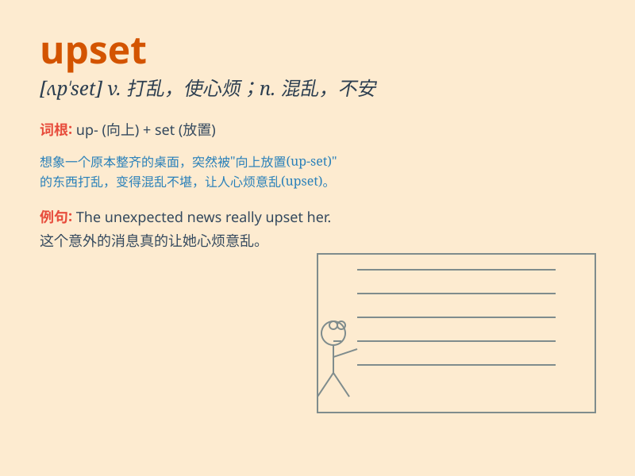

## upset

**英音:** _[ʌp\'set]_ **美音:** _[ʌp\'sɛt]_

**译义:** *vt.颠覆,推翻,扰乱,使不适,使心烦vi.翻倒,倾覆n.翻倒,混乱*

### 短语

+ **upset stomach:** _肠胃不适；肚子痛_

+ **get upset:** _感到不安；感到心烦_

+ **upset the balance:** _打破平衡_

+ **upset price:** _拍卖底价；起价_

+ **be upset about:** _为\...\...感到不安_

### 例句

#### 例句1

> **She was very upset when she heard the bad news.**

**中文翻译:** 当她听到这个坏消息时，她非常心烦意乱。

**单词释义:** 心烦的；苦恼的

#### 例句2

> **The rain upset our plans for a picnic.**

**中文翻译:** 这场雨打乱了我们的野餐计划。

**单词释义:** 打乱；搅乱

#### 例句3

> **He upset the vase by accident.**

**中文翻译:** 他不小心打翻了花瓶。

**单词释义:** 打翻；弄翻

### 背诵小故事

> 小明精心准备的生日派对因为下雨取消了，这让他感到非常
upset。他原本期待和朋友们一起快乐玩耍，结果计划泡汤，心情糟糕极了。

**小明精心准备的生日派对因雨取消，这使他非常心烦意乱。他原本期待与朋友们一起欢乐玩耍，结果计划落空，心情极差。**

### 图义

