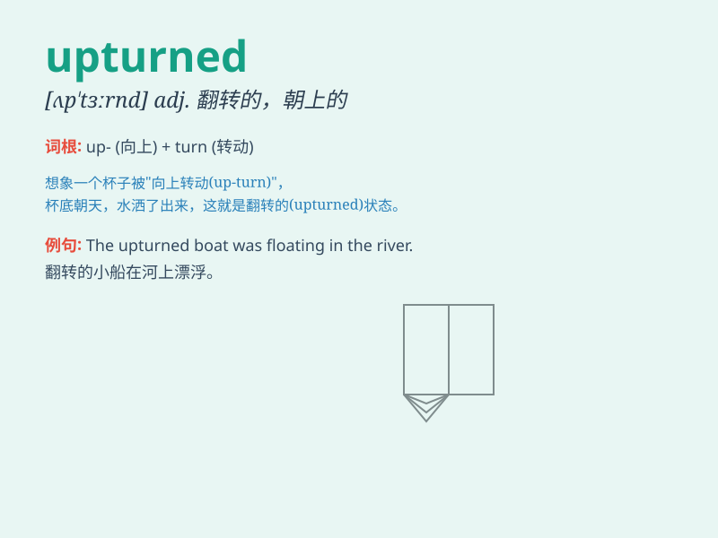

## upturned

**英音:** _[ˌʌpˈtɜːnd]_ **美音:** _[ˌʌpˈtɜːrnd]_

**译义:** *adj.朝上的,翻过来的*

### 短语

+ **upturned face:** _仰起的脸_

+ **upturned nose:** _上翘的鼻子_

+ **upturned lips:** _上翘的嘴唇_

+ **upturned boat:** _翻倒的船_

+ **upturned collar:** _竖起的衣领_

### 例句

#### 例句1

> **She had an upturned nose, which gave her a cute look.**

**中文翻译:** 她有一个向上翘的鼻子，这让她看起来很可爱。

**单词释义:** 向上翘的（形容鼻子的形状）

#### 例句2

> **The upturned boat was floating in the middle of the river.**

**中文翻译:** 那艘翻过来的船在河中央漂浮着。

**单词释义:** 翻过来的（形容船的状态）

#### 例句3

> **He looked at the upturned flowerpot with surprise.**

**中文翻译:** 他惊讶地看着那个倒扣着的花盆。

**单词释义:** 倒扣着的（形容花盆的放置方式）

### 背诵小故事

> One day, while walking in the forest, I saw an upturned boat. It was
as if it had been tossed by a big wave. The bottom of the boat faced
upwards, showing its worn-out surface. This strange sight made me
remember the word \'upturned\'.

**有一天，在森林里散步时，我看到一艘翻过来的船。就好像被大浪掀翻了一样。船底朝上，露出了它破旧的表面。这个奇怪的景象让我记住了"upturned（朝上的；翻转的）"这个单词。**

### 图义

