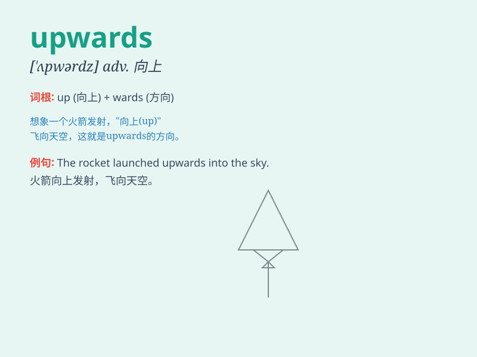

## upwards

**英音:** _[ˈʌpwədz]_ **美音:** _[ˈʌpwərdz]_

**译义:** *adv.以上,向上*

### 短语

+ **upwards of:** _多于；超过_

+ **look upwards:** _向上看_

+ **move upwards:** _向上移动_

+ **point upwards:** _指向上方_

+ **go upwards:** _上升；上涨_

### 例句

#### 例句1

> **The smoke rose upwards.**

**中文翻译:** 烟向上冒。

**单词释义:** 向上

#### 例句2

> **Prices have moved upwards recently.**

**中文翻译:** 最近物价上涨了。

**单词释义:** 向上；上涨

#### 例句3

> **She climbed upwards for half an hour.**

**中文翻译:** 她向上爬了半个小时。

**单词释义:** 向上

### 背诵小故事

> A little bird wanted to reach the stars. It flew upwards and upwards,
passing through the clouds. Finally, it got close to its dream.
\'Upwards\' means moving in an upward direction.

**一只小鸟想要够到星星。它向上飞啊飞，穿过云层。最终，它接近了梦想。'upwards'意思是向上的方向移动。**

### 图义

