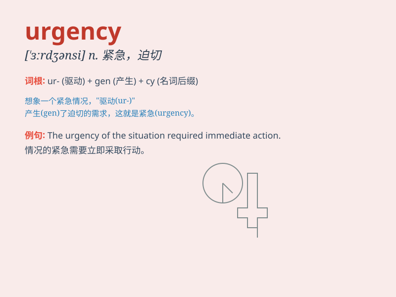

## urgency

**英音:** _[\'ɜːdʒ(ə)nsɪ]_ **美音:** _[\'ɝdʒənsi]_

**译义:** *n.紧急,紧急的事,强求,催促,坚持*

### 短语

+ **sense of urgency:** _紧迫感_

+ **urgency level:** _紧急程度_

+ **urgency factor:** _紧急因素_

+ **handle with urgency:** _紧急处理_

+ **in urgent need of:** _急需_

### 例句

#### 例句1

> **The doctor recognized the urgency of the patient\'s condition and
acted quickly.**

**中文翻译:** 医生意识到病人病情的紧急性并迅速采取了行动。

**单词释义:** 紧急；紧迫

#### 例句2

> **There is an urgency to solve the environmental problems before
it\'s too late.**

**中文翻译:** 在为时已晚之前解决环境问题具有紧迫性。

**单词释义:** 紧迫；急切

#### 例句3

> **He spoke with urgency in his voice, trying to convince us of the
importance of the matter.**

**中文翻译:** 他说话时声音里带着急切，试图让我们相信这件事的重要性。

**单词释义:** 急切；紧迫

### 背诵小故事

> A man was running in the street with urgency. He needed to catch the
last train to see his sick mother. His heart was pounding, knowing time
was of the essence.

**一个男人急匆匆地在街上跑。他得赶上最后一班火车去看他生病的母亲。他的心怦怦直跳，深知时间紧迫。**

### 图义

