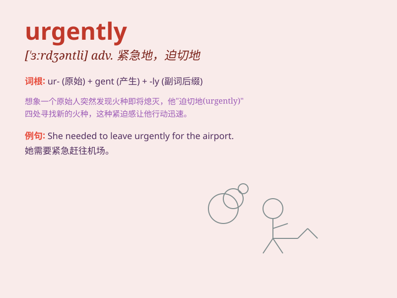

## urgently

**英音:** _[ˈɜːdʒəntli]_ **美音:** _[ˈɜrdʒəntli]_

**译义:** *adv.迫切地,急切地*

### 短语

+ **urgently needed:** _急需_

+ **urgently require:** _迫切需要_

+ **call urgently:** _紧急呼叫_

+ **demand urgently:** _紧急要求_

+ **seek urgently:** _急切寻求_

### 例句

#### 例句1

> **The injured man was urgently rushed to the hospital.**

**中文翻译:** 那个受伤的人被紧急送往医院。

**单词释义:** 紧急地

#### 例句2

> **We need to solve this problem urgently.**

**中文翻译:** 我们急需解决这个问题。

**单词释义:** 迫切地

#### 例句3

> **She called me urgently, asking for help.**

**中文翻译:** 她紧急地打电话给我，请求帮助。

**单词释义:** 急切地

### 背诵小故事

> One day, a little girl was lost in a big city. Her parents needed to
find her urgently. They called the police and everyone started searching
right away. \'Urgently\' means with great haste and importance.

**有一天，一个小女孩在大城市里走失了。她的父母急需找到她。他们报了警，所有人立刻开始寻找。'urgently'意思是非常匆忙且重要地。**

### 图义

