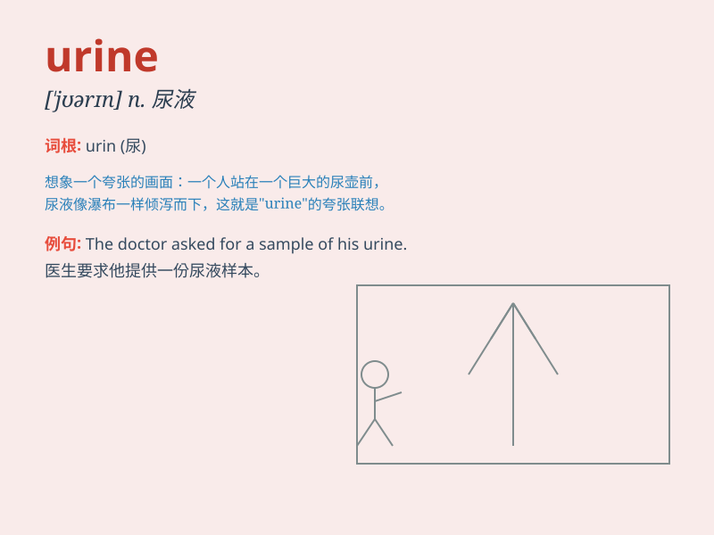

## urine

**英音:** _[\'jʊərɪn; -raɪn]_ **美音:** _[\'jʊrən]_

**译义:** *n.尿*

### 短语

+ **urine test:** _尿液检测_

+ **urine sample:** _尿样_

+ **urine analysis:** _尿液分析_

+ **urine output:** _尿量_

+ **urine retention:** _尿潴留_

### 例句

#### 例句1

> **The doctor analyzed the urine sample for signs of infection.**

**中文翻译:** 医生分析尿液样本以寻找感染的迹象。

**单词释义:** 尿液

#### 例句2

> **The smell of urine was quite strong in the restroom.**

**中文翻译:** 洗手间里尿液的气味相当浓烈。

**单词释义:** 尿液

#### 例句3

> **The cat urinated on the carpet, leaving a stain of urine.**

**中文翻译:** 猫在地毯上撒尿，留下了一滩尿液。

**单词释义:** 尿液

### 背诵小故事

> A doctor was testing a patient\'s urine. The patient was nervous but
the doctor said, \'Don\'t worry. Urine is just a liquid that tells us
about your health.\'

**一位医生正在检测一位病人的尿液。病人很紧张，但医生说：'别担心。尿液只是一种能告诉我们你健康状况的液体。'**

### 图义

