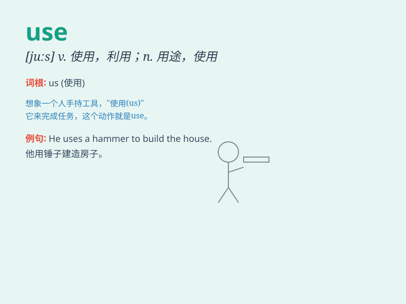

## use

**英音:** _[juːz]_ **美音:** _[juz]_

**译义:** *vt.使用,利用,耗费n.使用,利用,用途,效用,使用价值*

### 短语

+ **make use of:** _使用；利用_

+ **put to use:** _使用；利用_

+ **be in use:** _在使用中_

+ **come into use:** _开始被使用_

+ **go out of use:** _不再被使用_

### 例句

#### 例句1

> **I use a pen to write.**

**中文翻译:** 我用一支笔来写字。

**单词释义:** 使用

#### 例句2

> **This machine is no longer in use.**

**中文翻译:** 这台机器不再使用了。

**单词释义:** 使用；利用

#### 例句3

> **You should make good use of your time.**

**中文翻译:** 你应该好好利用你的时间。

**单词释义:** 利用

### 背诵小故事

> One day, a little boy wanted to draw. He found a pen and USED it to
create a beautiful picture. He was so happy because he knew how to USE
things to achieve his goal.

**一天，一个小男孩想要画画。他找到了一支笔并使用它创作了一幅美丽的画。他非常高兴，因为他知道如何使用东西来达成自己的目标。**

### 图义

