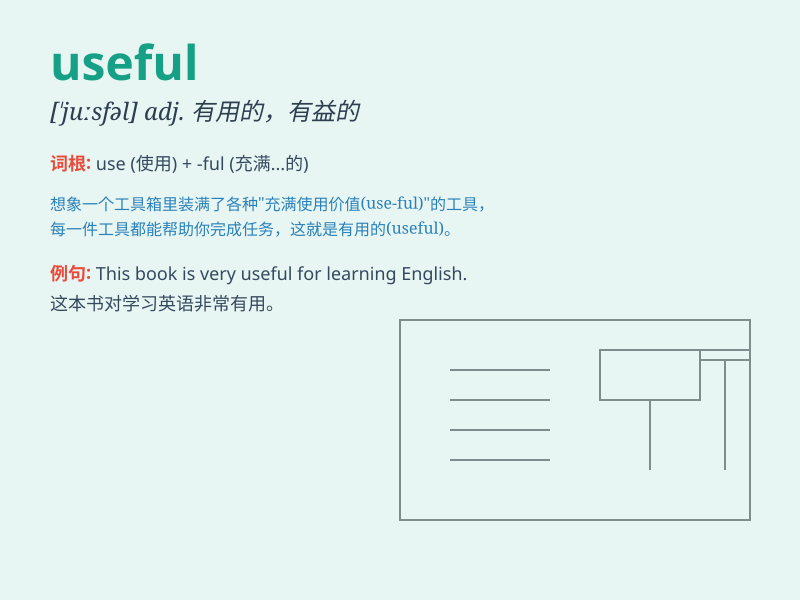

## useful

**英音:** _[\'juːsfʊl; -f(ə)l]_ **美音:** _[\'jusfl]_

**译义:** *adj.有用的,有益的,有帮手的*

### 短语

+ **be useful for:** _对\...\...有用_

+ **useful information:** _有用的信息_

+ **useful tool:** _有用的工具_

+ **very useful:** _非常有用_

+ **useful advice:** _有用的建议_

### 例句

#### 例句1

> **This dictionary is very useful for students.**

**中文翻译:** 这本字典对学生非常有用。

**单词释义:** 有用的

#### 例句2

> **The new tool proved to be extremely useful in our work.**

**中文翻译:** 这个新工具在我们的工作中被证明是极其有用的。

**单词释义:** 有用的

#### 例句3

> **Her advice was useful in solving the problem.**

**中文翻译:** 她的建议对解决这个问题很有用。

**单词释义:** 有用的

### 背诵小故事

> One day, Tom was lost in the forest. Luckily, he found a useful map
that guided him out. The map was so helpful that it made his dangerous
situation much easier. Without it, Tom might have been stuck there
forever.

**一天，汤姆在森林里迷路了。幸运的是，他找到了一张有用的地图，指引他走了出来。这张地图非常有帮助，让他危险的处境轻松了许多。没有它，汤姆可能会永远被困在那里。**

### 图义

