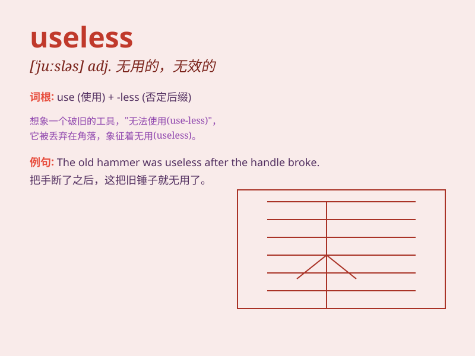

## useless

**英音:** _[ˈju:sləs]_ **美音:** _[juslɪs]_

**译义:** *adj.无用的,无效的,无益的,无价值的*

### 短语

+ **useless information:** _无用的信息_

+ **useless talk:** _无意义的谈话_

+ **useless attempt:** _徒劳的尝试_

+ **useless object:** _无用的物品_

+ **useless skill:** _无用的技能_

### 例句

#### 例句1

> **This old computer is useless. **

**中文翻译:** 这台旧电脑没用了。

**单词释义:** 无用的；无效的

#### 例句2

> **His attempts to fix the car were useless. **

**中文翻译:** 他修理汽车的尝试是徒劳的。

**单词释义:** 无效的；徒劳的

#### 例句3

> **It\'s useless to worry about things you can\'t change. **

**中文翻译:** 为你无法改变的事情担忧是没用的。

**单词释义:** 无用的；无益的

### 背诵小故事

> A man tried to fix his broken car all day but his efforts were
useless. No matter what he did, the car still wouldn\'t start. It made
him very frustrated.

**一个男人一整天都试图修理他坏掉的汽车，但他的努力是无用的。无论他做什么，汽车仍然无法启动。这让他非常沮丧。**

### 图义

