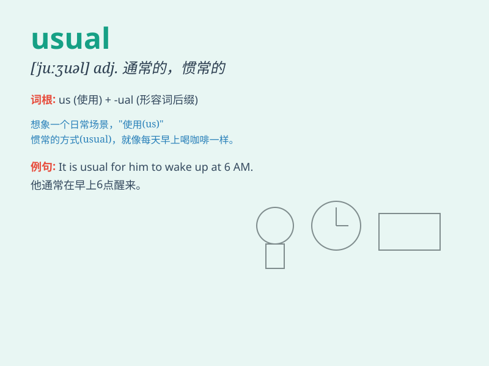

## usual

**英音:** _[\'juːʒʊəl]_ **美音:** _[\'juʒuəl]_

**译义:** *adj.平常的,通常的,惯例的*

### 短语

+ **as usual:** _像往常一样；照例_

+ **out of the usual:** _与众不同；异常_

+ **usual practice:** _通常做法；惯例_

+ **usual suspects:** _惯犯；嫌疑惯犯_

+ **usual place:** _常去的地方_

### 例句

#### 例句1

> **It\'s usual for him to arrive late.**

**中文翻译:** 他迟到是常有的事。

**单词释义:** 通常的；惯常的

#### 例句2

> **She wore her usual dress to the party.**

**中文翻译:** 她穿着平常的裙子去参加聚会。

**单词释义:** 平常的；平素的

#### 例句3

> **As usual, he forgot his keys.**

**中文翻译:** 像往常一样，他忘了带钥匙。

**单词释义:** 往常的；一向的

### 背诵小故事

> One day, Tom went to school as usual. But this time, he found a
strange key on the way. It was not a usual thing for him. Usually, his
way to school was quite normal.

**一天，汤姆像往常一样去上学。但这次，他在路上发现了一把奇怪的钥匙。这对他来说不是寻常的事。通常，他上学的路都很平常。**

### 图义

