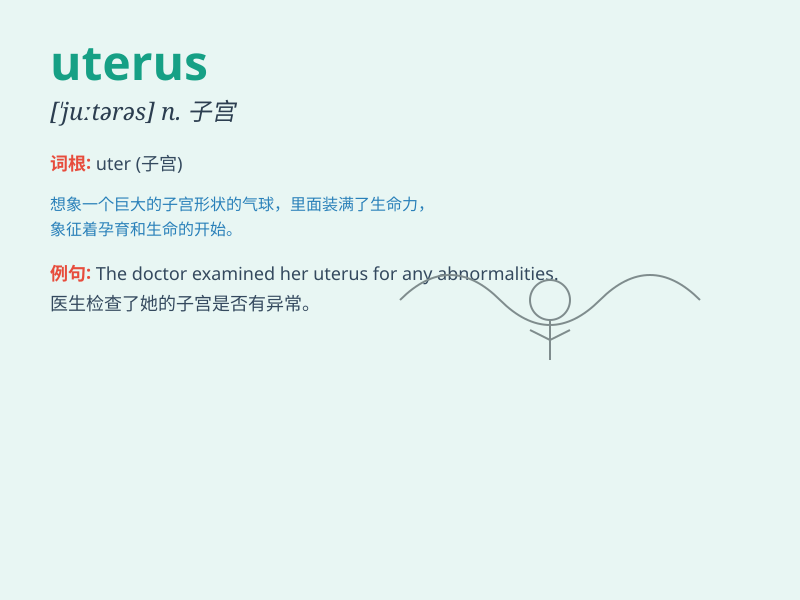

## uterus

**英音:** _[\'juːt(ə)rəs]_ **美音:** _[\'jutərəs]_

**译义:** *n.[解]子宫*

### 短语

+ **uterus cancer:** _子宫癌_

+ **uterus transplantation:** _子宫移植_

+ **uterus fibroids:** _子宫肌瘤_

+ **uterus prolapse:** _子宫脱垂_

+ **pregnant uterus:** _怀孕的子宫_

### 例句

#### 例句1

> **The doctor examined the patient\'s uterus during the
gynecological examination.**

**中文翻译:** 医生在妇科检查中检查了病人的子宫。

**单词释义:** 子宫

#### 例句2

> **Uterine fibroids can cause heavy bleeding and pain.**

**中文翻译:** 子宫肌瘤会导致大量出血和疼痛。

**单词释义:** 子宫

#### 例句3

> **The health of the uterus is crucial for a woman\'s reproductive
system.**

**中文翻译:** 子宫的健康对于女性的生殖系统至关重要。

**单词释义:** 子宫

### 背诵小故事

> A woman was very worried about her health. The doctor told her to
take care of her uterus. The uterus is like a special room in a woman\'s
body where babies grow. So it\'s very important!

**一位女士很担心自己的健康。医生告诉她要照顾好子宫。子宫就像女性身体里一个特殊的房间，宝宝在里面成长。所以它非常重要！**

### 图义

