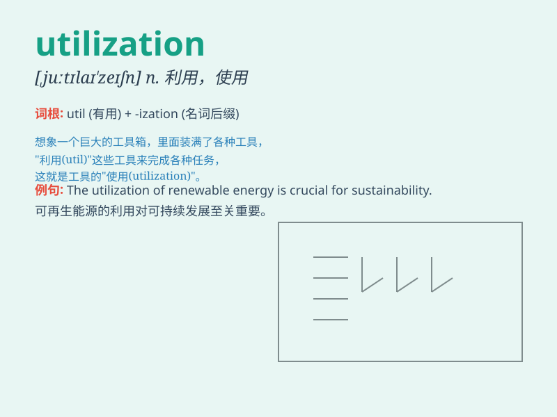

## utilization

**英音:** _[,juːtɪlaɪ\'zeɪʃən]_ **美音:**
_[,jutɪlaɪ\'zeʃən]_

**译义:** *n.利用*

### 短语

+ **resource utilization:** _资源利用_

+ **efficient utilization:** _高效利用_

+ **maximize utilization:** _最大限度地利用_

+ **rational utilization:** _合理利用_

+ **utilization rate:** _利用率_

### 例句

#### 例句1

> **The utilization of solar energy is becoming more and more
common.**

**中文翻译:** 太阳能的利用正变得越来越普遍。

**单词释义:** 利用；使用

#### 例句2

> **We need to improve the utilization rate of resources.**

**中文翻译:** 我们需要提高资源的利用率。

**单词释义:** 利用率

#### 例句3

> **The new technology enhances the utilization of raw materials.**

**中文翻译:** 这项新技术提高了原材料的利用。

**单词释义:** 利用

### 背诵小故事

> A factory was in trouble because of low utilization of its machines.
But a smart engineer found a way to improve it. Now the factory operates
smoothly, making full utilization of resources.

**一家工厂因为机器利用率低而陷入困境。但一位聪明的工程师找到了改进的方法。现在工厂运行顺畅，充分利用了资源。**

### 图义

