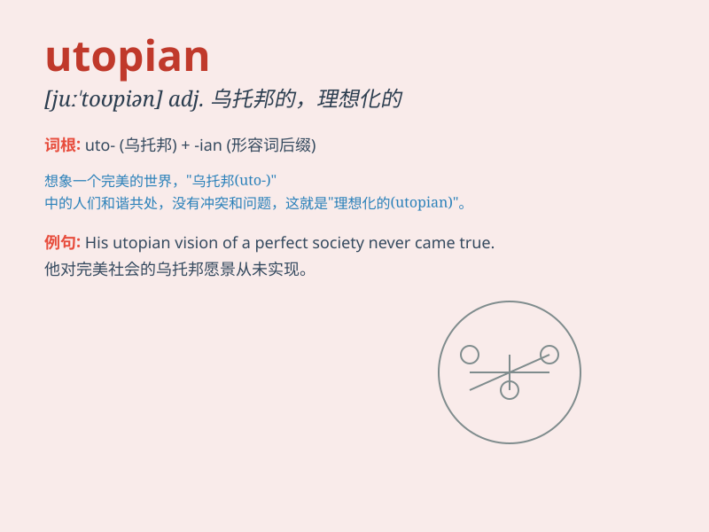

## utopian

**英音:** _[juːˈtəʊpiən]_ **美音:** _[juːˈtoʊpiən]_

**译义:** *adj.乌托邦的,理想化的*

### 短语

+ **utopian ideal:** _乌托邦式的理想_

+ **utopian society:** _乌托邦社会_

+ **utopian vision:** _乌托邦愿景_

+ **utopian dream:** _乌托邦之梦_

+ **utopian project:** _乌托邦工程_

### 例句

#### 例句1

> **The idea of a utopian society where everyone is equal is
appealing but often unrealistic.**

**中文翻译:** 一个人人平等的乌托邦社会的想法很吸引人，但往往不现实。

**单词释义:** 乌托邦式的；空想的

#### 例句2

> **His utopian plans for solving the world\'s problems were met with
skepticism.**

**中文翻译:** 他解决世界问题的乌托邦式计划遭到了怀疑。

**单词释义:** 空想的；不切实际的

#### 例句3

> **The novel presents a utopian vision of a future without war or
poverty.**

**中文翻译:** 这部小说展现了一个没有战争和贫困的未来的乌托邦愿景。

**单词释义:** 乌托邦式的；理想化的

### 背诵小故事

> A group of friends decided to build a community. They had many
beautiful and ideal plans, like no pollution and everyone being happy.
But these ideas were too perfect and not practical. Their dream was
utopian.

**一群朋友决定建立一个社区。他们有很多美好且理想化的计划，比如没有污染且人人都快乐。但这些想法太完美而不切实际。他们的梦想是乌托邦式的。**

### 图义

