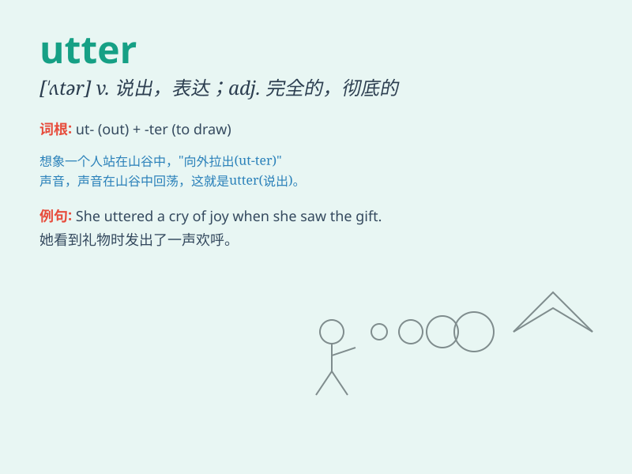

## utter

**英音:** _[\'ʌtə]_ **美音:** _[\'ʌtɚ]_

**译义:** *adj.全然的,绝对的vt.发出,做声,发表,发射,流通*

### 短语

+ **utter nonsense:** _完全胡说；一派胡言_

+ **utter darkness:** _一片漆黑_

+ **utter stranger:** _完全陌生的人_

+ **utter failure:** _彻底失败_

+ **utter exhaustion:** _极度疲惫_

### 例句

#### 例句1

> **He let out an utter cry of pain.**

**中文翻译:** 他发出了一声完全的痛苦叫声。

**单词释义:** 完全的；彻底的

#### 例句2

> **She was in utter confusion.**

**中文翻译:** 她完全处于困惑之中。

**单词释义:** 完全的；十足的

#### 例句3

> **The room was in utter darkness.**

**中文翻译:** 房间里一片漆黑。

**单词释义:** 完全的；绝对的

### 背诵小故事

>
想象一下，在一个安静的图书馆里，突然有人大声'utter'（说出）了一个秘密，所有人都被惊到了。这个人完全没有保留，毫无顾忌地把秘密说了出来。

**想象在图书馆有人毫无保留地说出秘密来辅助记忆'utter'这个单词，意思是说出、表达**

### 图义

