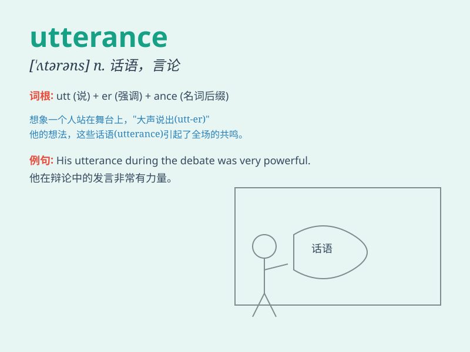

## utterance

**英音:** _[\'ʌt(ə)r(ə)ns]_ **美音:** _[\'ʌtərəns]_

**译义:** *n.意见,说话,发表,说话的方式,死*

### 短语

+ **clear utterance:** _清晰的表达_

+ **forceful utterance:** _有力的言辞_

+ **spontaneous utterance:** _自发的话语_

+ **eloquent utterance:** _雄辩的言论_

+ **incoherent utterance:** _不连贯的话语_

### 例句

#### 例句1

> **His utterance of the word was barely audible.**

**中文翻译:** 他说这个词的声音几乎听不见。

**单词释义:** 话语；言论

#### 例句2

> **The politician\'s latest utterance caused a public outcry.**

**中文翻译:** 这位政治家的最新言论引起了公众的强烈抗议。

**单词释义:** 言论；表达

#### 例句3

> **Her utterance was filled with emotion.**

**中文翻译:** 她的话语充满了情感。

**单词释义:** 话语；言语

### 背诵小故事

> 想象一下，在一个魔法森林里，小精灵们每次开口说话，发出的声音都被称为
utterance。有一天，一个小精灵勇敢地做出了重要的 utterance，拯救了森林。

**想象在魔法森林中，小精灵们每次开口发声被称为
utterance。某天，一小精灵勇敢发声拯救了森林。**

### 图义

