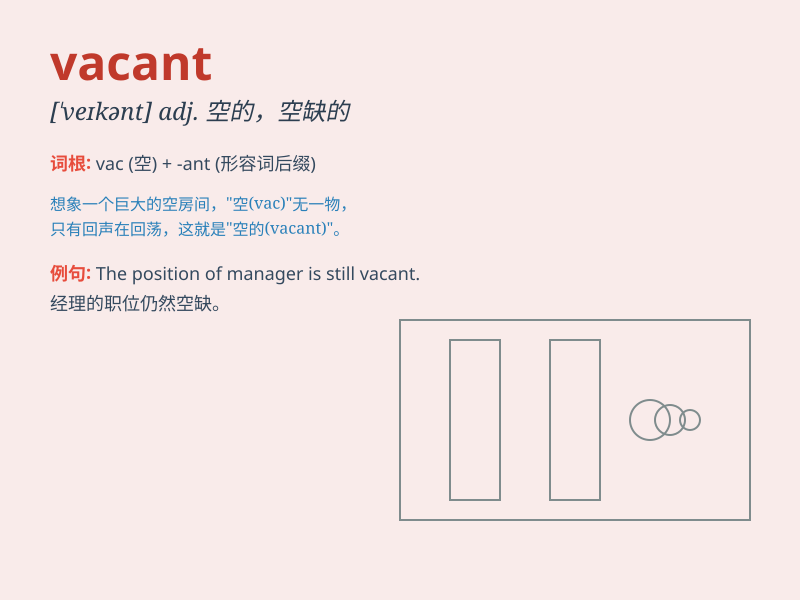

## vacant

**英音:** _[\'veɪk(ə)nt]_ **美音:** _[\'vekənt]_

**译义:**
*adj.空的,空白的,空灵的,头脑空虚的,神情茫然的,空闲的,空缺的*

### 短语

+ **vacant position:** _空缺职位_

+ **vacant lot:** _空地_

+ **vacant room:** _空房间_

+ **vacant stare:** _茫然的凝视_

+ **vacant mind:** _空虚的心灵_

### 例句

#### 例句1

> **The hotel had several vacant rooms.**

**中文翻译:** 这家酒店有几个空房间。

**单词释义:** 空的；未被占用的

#### 例句2

> **She stared at the vacant expression on his face.**

**中文翻译:** 她盯着他脸上茫然的表情。

**单词释义:** 茫然的；失神的

#### 例句3

> **The position remained vacant for months.**

**中文翻译:** 这个职位空缺了好几个月。

**单词释义:** 空缺的

### 背诵小故事

>
想象一个空荡荡的房子，里面什么家具都没有，房间显得很空荡。这个空荡的房子就像单词\'vacant\'所表达的意思，没有被占用，是空的。

**想象一个空房子来辅助理解\'vacant\'（空的；未被占用的）这个单词**

### 图义

