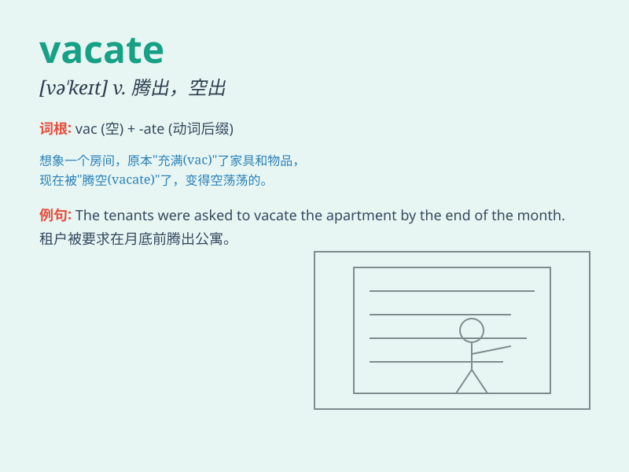

## vacate

**英音:** _[veɪ\'keɪt; və\'keɪt]_ **美音:** _[ˈveɪˌkeɪt;
veɪˈkeɪt]_

**译义:** *v.腾出,空出,离(职),退(位)*

### 短语

+ **vacate a position:** _辞去职位_

+ **vacate a room:** _腾出房间_

+ **vacate the premises:** _撤离房屋_

+ **vacate one\'s seat:** _腾出座位_

+ **vacate the throne:** _退位_

### 例句

#### 例句1

> **The tenant was required to vacate the apartment by the end of the
month.**

**中文翻译:** 租户被要求在月底前搬出公寓。

**单词释义:** 搬出，腾出

#### 例句2

> **He vacated his position as the company\'s CEO last year.**

**中文翻译:** 他去年辞去了公司首席执行官的职位。

**单词释义:** 辞去，空出

#### 例句3

> **The workers were ordered to vacate the building immediately due
to safety concerns.**

**中文翻译:** 出于安全考虑，工人们被命令立即离开这栋大楼。

**单词释义:** 离开，撤离

### 背诵小故事

>
想象一个租客接到通知，必须马上离开（vacate）他现在租的房子。因为房东要重新装修，所以租客赶紧收拾东西走人。

**想象一个租客接到通知必须离开他所租的房子的情景来辅助记忆【vacate】这个单词，意为腾出，空出，撤离**

### 图义

