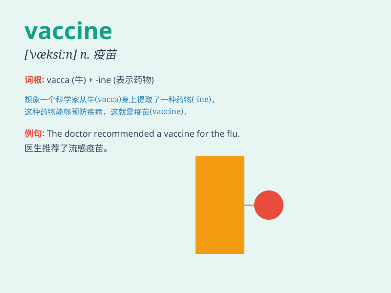

## vaccine

**英音:** _[\'væksiːn; -ɪn]_ **美音:** _[væk\'sin]_

**译义:** *adj.疫苗的,牛痘的n.疫苗*

### 短语

+ **vaccine injection:** _疫苗注射_

+ **vaccine dose:** _疫苗剂量_

+ **vaccine efficacy:** _疫苗效力_

+ **vaccine research:** _疫苗研究_

+ **vaccine development:** _疫苗开发_

### 例句

#### 例句1

> **The vaccine provides immunity against the disease.**

**中文翻译:** 这种疫苗能提供对这种疾病的免疫力。

**单词释义:** 疫苗

#### 例句2

> **They are conducting clinical trials for a new vaccine.**

**中文翻译:** 他们正在为一种新疫苗进行临床试验。

**单词释义:** 疫苗

#### 例句3

> **The government is working to ensure the wide distribution of the
vaccine.**

**中文翻译:** 政府正在努力确保疫苗的广泛分发。

**单词释义:** 疫苗

### 背诵小故事

> One day, a little girl was very scared of getting sick. But then, the
doctor gave her a vaccine. It was like a magic potion that would protect
her from the bad germs. With the vaccine, she knew she would be safe and
healthy.

**有一天，一个小女孩非常害怕生病。但后来，医生给了她一支疫苗。它就像一种神奇的药水，可以保护她免受坏病菌的侵害。有了疫苗，她知道自己会安全和健康。**

### 图义

