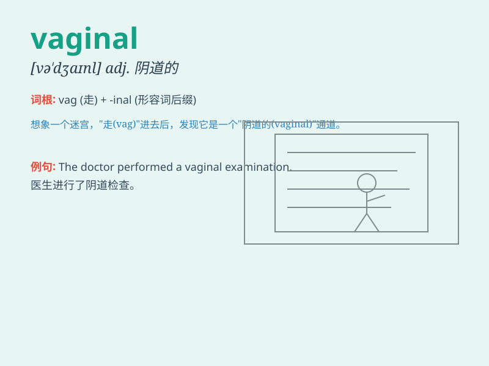

## vaginal

**英音:** _[və\'dʒaɪnəl]_ **美音:** _[və\'dʒaɪnl]_

**译义:** *adj.叶鞘的,阴道的*

### 短语

+ **vaginal discharge:** _阴道分泌物_

+ **vaginal infection:** _阴道感染_

+ **vaginal wall:** _阴道壁_

+ **vaginal smear:** _阴道涂片_

+ **vaginal canal:** _阴道管_

### 例句

#### 例句1

> **The doctor performed a vaginal examination.**

**中文翻译:** 医生进行了一次阴道检查。

**单词释义:** 阴道的

#### 例句2

> **She experienced vaginal bleeding after the accident.**

**中文翻译:** 事故发生后，她出现了阴道出血的情况。

**单词释义:** 阴道的

#### 例句3

> **The vaginal infection required immediate treatment.**

**中文翻译:** 阴道感染需要立即治疗。

**单词释义:** 阴道的

### 背诵小故事

> A woman went to the doctor because of vaginal discomfort. The doctor
carefully examined and gave her some advice. Remember, \'vaginal\'
refers to something related to the vagina.

**一位女士因为阴道不适去看医生。医生仔细检查并给了她一些建议。记住，\'vaginal\'指的是与阴道有关的东西。**

### 图义

