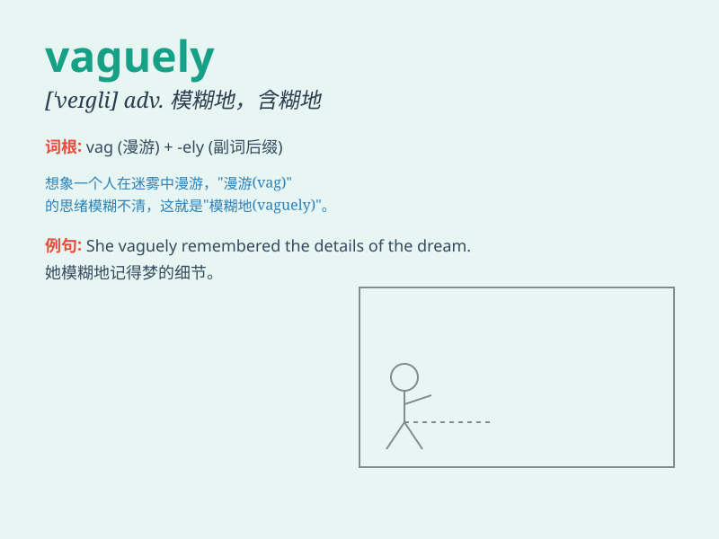

## vaguely

**英音:** _[\'veɪglɪ]_ **美音:** _[\'veɡli]_

**译义:** *adv.含糊地,暧昧地*

### 短语

+ **vaguely familiar:** _有点熟悉_

+ **vaguely aware:** _隐约意识到_

+ **vaguely remember:** _模糊地记得_

+ **vaguely defined:** _定义模糊_

+ **vaguely describe:** _模糊地描述_

### 例句

#### 例句1

> **She vaguely remembered meeting him before.**

**中文翻译:** 她隐约记得以前见过他。

**单词释义:** 模糊地；不确切地

#### 例句2

> **He spoke vaguely of his plans for the future.**

**中文翻译:** 他含混地谈到了他未来的计划。

**单词释义:** 含糊地；不明确地

#### 例句3

> **The figure in the distance was only vaguely visible.**

**中文翻译:** 远处的那个身影只是隐约可见。

**单词释义:** 稍微；略微

### 背诵小故事

> A traveler was lost in a strange town. When asked for directions, the
locals answered vaguely, saying \'Maybe go that way.\' The traveler was
confused. He realized \'vaguely\' means not clearly or precisely.

**一位旅行者在一个陌生的城镇迷路了。当他问路时，当地人回答得很含糊，说'也许走那边'。旅行者感到困惑。他明白了'vaguely'意思是不清晰、不确切地。**

### 图义

