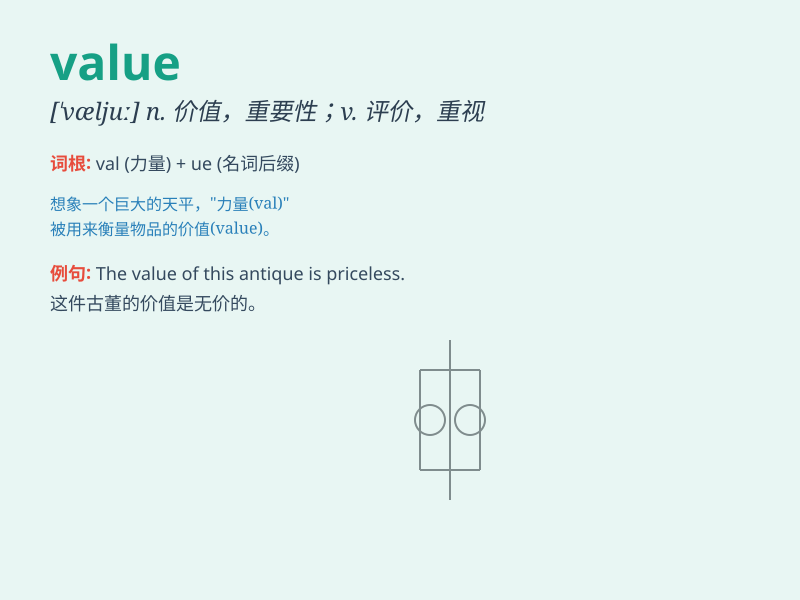

## value

**英音:** _[\'væljuː]_ **美音:** _[\'vælju]_

**译义:**
*n.价值,估价,评价,价格,[数]值,确切涵义vt.估价,评价,重视*

### 短语

+ **value for money:** _物有所值_

+ **of great value:** _非常有价值_

+ **put a value on:** _给\...估价_

+ **value oneself on:** _以\...自豪_

+ **market value:** _市场价值_

### 例句

#### 例句1

> **The value of this antique is very high.**

**中文翻译:** 这件古董的价值非常高。

**单词释义:** 价值

#### 例句2

> **I value your friendship more than anything else.**

**中文翻译:** 我珍视你的友谊胜过一切。

**单词释义:** 珍视

#### 例句3

> **The company tries to increase the value of its products through
innovation.**

**中文翻译:** 公司试图通过创新来增加其产品的价值。

**单词释义:** 价值

### 背诵小故事

> A poor man found a treasure chest. He knew the jewels inside had
great value. But he didn\'t keep them for himself. Instead, he sold them
and used the money to help others.

**一个穷人发现了一个宝箱。他知道里面的珠宝有很大的价值。但他没有据为己有。相反，他卖掉了它们并用这笔钱去帮助别人。**

### 图义

